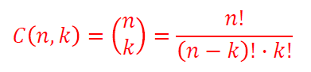
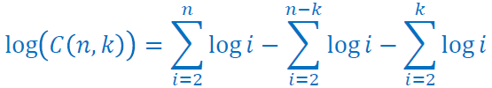
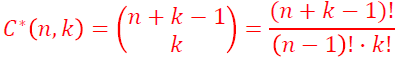

# 1. Kombinatorika

## 1.1 Faktoriál

Faktoriál je definován pro **nezáporná celá** čísla:

```
n! = n × (n-1) × (n-2) × ... × 2 × 1
```

Výpočet pro velká _n_ pomocí Stirlingova vzorce:

```
n! = √(2𝜋n)(n/e)^n(1+1/12n)
```

nebo lze použít logaritmus:

```
log(n!) = 1/2×log(2𝜋n) + nlog(n) - nlog(e)
```

Rozšíření na reálná čísla, pomocí Gamma funkce

- Γ(z) je Gamma funkce
- z! = Γ(z+1)
- Γ(z) = ∫t<sup>z-1</sup>e<sup>-t</sup>dt od 0 do ∞
- factorial(4)=gamma(5)=24

## 1.2 Základní kombinatorická pravidla

### 1.2.1 Kombinatorické pravidlo součinu

Počet všech uspořádaných _k_-tic, jejichž první člen lze vybrat _n<sub>1</sub>_ způsoby, druhý _n<sub>2</sub>_ způsoby po výběru členu předchozího, až _k_-tý člen po výběru všech předcházejících členů, přičemž se členy navzájem neovlivňují (jsou nezávislé), je roven _n<sub>1</sub>_ × _n<sub>2</sub>_ × ... × _n<sub>k</sub>_.

### 1.2.1 Kombinatorické pravidlo součtu

Jsou-li _A<sub>1</sub>_, _A<sub>2</sub>_, ..., _A<sub>n</sub>_ konečné množiny, které mají po řadě _n<sub>1</sub>_, _n<sub>2</sub>_, ... _n<sub>k</sub>_ prvků, a jsou-li každé dvě disjunktní, pak počet prvků množiny _A<sub>1</sub>_ ∪ _A<sub>2</sub>_ ∪ ... ∪ _A<sub>k</sub>_ je roven _n<sub>1</sub>_ + _n<sub>2</sub>_ + ... + _n<sub>k</sub>_.

## 1.3 Uspořádané výběry - variace, permutace

U uspořádaných výběřů záleží na pořadí

### 1.3.1 Variace bez opakování

Každá uspořádaná _k_-tice navzájem různých prvků se nazývá variace _k_té třídy bez opakování. Počet variací \_k_-tétřídy bez opakování nazýváme variační číslo a značíme jej _V(n,k)_:

```
            n!
V(n,k) = --------
         (n - k)!
```

### 1.3.2 Permutace bez opakování

Každé navzájem různé uspořádání množiny prvků. Počet permutací _n_ prvkové množiny lze stanovit ze vstahu:

```
P(n) = V(n,n) = n!
```

### 1.3.3 Variace s opakováním

Variací _k_-té třídy s opakováním se předpokládá kaýdá uspořádaná _k_-tice prvků množiny, v níž se jednotlivé prvky mohou opakovat:

V\*(n,k) = n<sup>k</sup>

### 1.3.4 Permutace s opakováním

Permutace s opakováním jsou permutace, kde se prvky ve výběru mohou opakovat. Počet permutací s opakováním je určen:

```
                                n!
P*(n1,n2,n3,...,nk) = ---------------------
                      n1! × n2! × ... × nk!
```

, přičemž mezi vykranými prvky je _k_ skupin, které mají postupně _n<sub>1</sub>_, _n<sub>2</sub>_, ..., _n<sub>k</sub>_ stejných prvků a musí platit _n_ = ∑ _n<sub>i</sub>_

## 1.4 Neuspořádané výbery - kombinace

U neuspořádaných výběřů nezáleží na pořadí

### 1.4.1 Kombinace bez opakování

Kombinace _k_-té třídy bez opakování z _n_ prvlů nazveme každou _k_ prvkovou podmnožinu. Počet různých kombinací značíme:



Pro výpočet kombinačních čísel s velkým _n_, _k_ lze použít výpočet pomocí Stirlingova vzorce, nebo výpočet provést pomocí logaritmů:



Vzorec MATLAB: **nchoosek(n,k)**

### 1.4.2 Kombinace s opakováním

Kombinaci _k_-té třídy z _n_ prvků s opakováním nazveme každou _k_-člennou skupinu sestavenou z prvků množiny tak, že se prvky ve skupině mohou opakovat a přitom nezáleží na jejich pořadí. Počet kombinací s opakováním je dán vzorcem:



Vzorec MATLAB: **nchoosek(n+k-1,k)**

## 1.5 Základní příkazy

- Faktoriál : **factorial(n)**
- Gamma fce : **gamma(n)**
- Komb. čís.: **nchoosek(n)**
