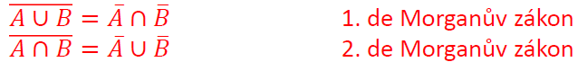
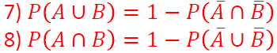
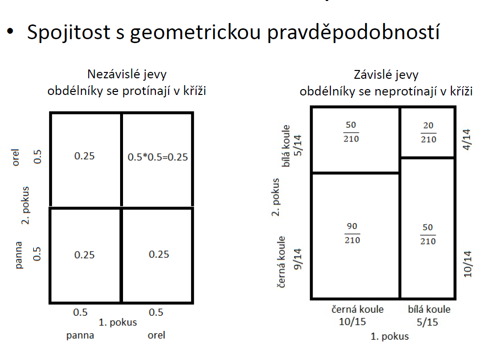
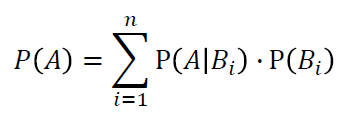
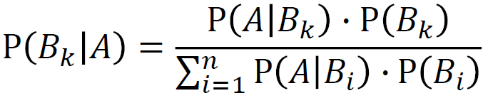

# Úvod do teorie pravděpodobnosti

## 2.1 Základní pojmy

- **Teorie pravděpodobnosti** - matematická disciplína, jejíž logická strukturaje budována axiomaticky. Její základ tvoří několik tvrzení, která vyjadřují základní vlastnosti pravděpodobnosti. Další tvrzení jsou z ní odvozena deduktivně
  - Kolika způsoby jsme schopni ..., Jolik existuje kombinací ...
  - Výsledky jsou vždy shodné
- **Matematická statistika** - věda zahrnující studium dat vykazujících náhodná kolísán, ať už jde o data získaná pečlivě připraveným pokusem provedeným pod stálou kontrolou experimentálních podmínek v laboratoři, či o data provozní, případně o dat azískaná počítačovými simulacemi (tzv. metodou _Monte-Carlo_)
  - Odlišné výsledky
- **Náhodný pokus** - každý děj, jehož výsledek není předem jednoznačně určen podmínkami, za kterých probíhá.
  - Př. hod mincí či kostkou, životnost výrobku, přesná velikost určitého rozměru
- **Množina možných výsledků {𝜔} pokusu, tzv. základní prostor Ω**
  - Množina možných výsledků musí být zvolena tak, aby žádné z nich nemohly nastat současně
  - Ω - rub, líc; hod koskou( 1, 2, 3, 4, 5, 6)
  - Ω - doba do poruchy R<sup>+</sup>; počet poruch Z<sup>+</sup>+{0}
  - Základní prostor není - sjednocení množin lichých čísel a čísel dělitelných tří beze zbytku
- **Náhodný jev** - představuje každou podmnožinu A základního prostoru Ω
  - Na kostce padne 3
- **Elementární jev** - jednoprvkové podmnožiny základního prostoru Ω
  - Na kostce padne sudé číslo. Jedná se o složený jev, protože mohou padnout čísla {2, 4, 6}. Čísla {2, 4, 6} tvoří elemntární jevy.
  - Životnost výrobku je mezi 2 až 3 roky

## 2.2 Označování jevů

- **Jistý jev** - jev, který nastane vždy při každé realizaci náhodného pokusu.
  - Při hodu mincí padne pana nebo orel
- **Nemožný jev** - jev, který nemůže nikdy nastat.
  - Výška člověka je menší než -5 metrů.
- **Jev A je podjevem jevu B** - nastal-li jev A, nastane vždy jev B
  - A⊂B
  - Příklad:
    - Jev A - člověk je menší než 160 cm
    - Jev B - člověk je menší než 170 cm
    - Jev A je podjevem jevu B
- **Rovnost jevů A a B** - nastal-li jev A, nastane vždy jev B a naopak
  - A=B
  - Jev A je sudé číslo, jev B je číslo dělitelné 2 beze zbytku
- **Disjunktní jevy A, B** - dva jevy A a B náhodného pokusu nemohou nikdy nastat současně
  - Hod kostkou disjunktní jevy jsou padnutí čísla 1 a 2
- **Doplněk jevu A - zančí se Ā** - jev Ā nastanevždy, když nenastane jev A
  - Při hodu kostkou je doplňkovým jevem jevu "padne 1" jev "padne 2, 3, 4, 5 nebo 6"
- **Průnik jevů A a B** - nastan, jestliže jevy A a B vzniknou současně
  - A∩B
  - Na šestistěnné kostce padne sudé číslo (jev A) a číslo menší rovno 3 (jev B). A∩B = {2}
- **Sjednocení jevů A a B** - nastane jestliže výsledkem bude jev A nebo jev B
  - A∪B
  - Na šestistěnné kostce padne sudé číslo (jev A) a číslo menší rovno 3 (jev B). A∪B = {1, 2, 3, 4, 6}
- **Základní pravidla pro operace s náhodnými jevy:**
  - A∪B = B∪A, A∩B = B∩A
  - A∪(B∪C) = (A∪B)∪C
  - A∩(B∩C) = (A∩B)∩C
  - A∪(B∩C) = (A∪B)∩(A∪C)
  - A∩(B∪C) = (A∩B)∪(A∩C)
  - A∪A = A, A∩A = A
  - A∪Ω = A, A∩Ω = Ω
  - 

## 2.3 Pravděpodobnost a její vlastnosti

### 2.3.1 Pravděpodobnost

- Pravděpodobností označujeme míru očekávatelnosti výskytu náhodného jevu.
- S rostoucí pravděpodobností roste i šance, že jev nastane.
- Pravděpodobnost se obecně označuje číslem z intervali <0;1>

### 2.3.2 Klasická pravděpodobnost

- Je-li základní prostor konečná neprázdná množina elementárních jevů, které mají stejnou šanci výskytu 1/n, potom pravděpodobnost, že při realizaci náhodného pokusu jev A nastane je P(A) = _m_/_n_, kde _m_ je počet výsledků příznivých jevů A, _n_ počet všech možných výsledků

### 2.3.3 Statistická pravděpodobnost

- Jestliže je náhodný pokus libovolněkrát opakovatelný za stejných podmínek, pak lze pravděpodobnost jevu odhadnout na základě počtu jevů příznivých výsledků pokusu
- Provedeme-li _n_ realizací náhodného pokusu, přičemž n(A) je počet příznivých realizací, potom pravděpodobnost jevu A lze odhadnout poměrem

```
        n(A)
P(A) = ------
         n
```

- Odhad je tím přesnější, čím větší je počet realizací náhodného pokusu.
- Jedná se o odhad pravděpodobnosti, přesná hodnota se obdrží limitně při nekonečném počtu pokusu.

* Na základě statistické pravděpodobnosti je odvozena "metoda Monte-Carlo", kdy se mnohonásobně opakuje náhodný pokus a sleduje se úspěšnost pokusů.
  - Náhodné pokusy mohou být fyzikální (hod kostkou, životnost výrobku)
  - Náhodné pokusy mohou být generovány pomocí čítače - for cyklus, funkce náhodné číslo (MATLAB: **unifrnd**)

### 2.3.4 Geometrická pravděpodobnost

- Lze použít, když počet všech možných výsledků náhodného pokusu je nespočetný
- Pravděpobnost je založená na porovnávání velikosti délek, plochy, objemů
- V prostoru je dána určitá oblast Ω a v ní podoblast A. Pravděpodobnost výskytu každého bodu v oblasti Ω je shodná. Potom pravděpodobnost jevu A (náhodně zvolený bod leží v oblasti A) lze zjistit dle vzorce P(A) = |A|/|Ω|, kde |A| a |Ω| jsou velikosti oblasti

### 2.3.5 Kolmogorova pravděpodobnost

- Zobecnění definice pravděpodobnosti
- Je-li 𝒜 jevové pole, pak pravděpodobnost na jevovém poli 𝔸 je jevová funkce, pro kterou platí Kolmogorovy axiomy pravděpodobnosti:
  1. Pravděpodobnost každého jevu A∈𝔸
  2. Pravděpodobnost jistého jevu je rovná jedné P(Ω) = 1
  3. Pravděpodobnost sjednocení spočetného počtu vzájemně neslučitelných jevů je rovna součtu jejich pravděpodobností

### 2.3.6 Vlastnosti pravděpodobnosti

- Jevy A,B ∈ 𝔸
  - Pravděpodobnost je omezena 0 a 1 včetně
    - 0<=P(A)<=1
  - Pravděpodobnost nemožného jevu je 0
    - P(∅) = 0
  - Pravděpodobnost doplňkiu k jevu A je
    - P(Ā) = 1 - P(A)
  - Jestliže A je podmnožina B, potom pravděpodobnost A je menší nebo rovna B
    - A⊂B; P(A)<=P(B)
  - Rozdíl jevů B-A je
    - P(B-A) = P(B)-P(A∩B)
  - Pravděpodobnost sjednocení jevů A a B - P(A∪B)=P(A)+P(B)-P(A∩B)
  - 

## 2.4 Nezávislost pokusů, podmíněná pravděpodobnost

### 2.4.1 Nezávislost pokusů

- Provedeme několik pokusů. Jestliže pravděpodobnost jevu A pri každém opakování nezávisí na výsledcích předchozích pokusů, potom jsou tyto pkusy nezávislými pokusy vzhledem k jevu A
- Pravděpodobnost jevu A je při všech pokusech setjná
- Nezávislé pokusy
  - Vysledky jednotlivých pokusů nejsou na sobě závislé
  - napříkad při dvou hodech mincí, jaká je pravděpodobnost, že padne 2× orel? 1/2 \* 1/2 = 1/4
- Závislé pokusy
  - pravděpodobnost nastoupení jevu v určitém pokusu je závislé na předchozích výsledcích
  - například Losování z osudí bez vracení. Před prvním vylosováním je v osudí _n_ míčků, ale při druhém je již míčků _n_-1



### 2.4.2 Podmíněná pravděpodobnost

- Pravděpodobnost, že nastane jev A za podmínky, že nastal jev B se vypočte podle vzorce:

```
          P(A∩B)
P(A|B) = --------
           P(B)
```

- Lze odvodit pravděpodobnost průniku dvou jevů

```
P(A∩B) = P(A|B) × P(B)
```

- U nezávislých jevů platí, že P(A|B)=P(A)
  - Nastoupení jevu B nemá žádný vliv na jev A


### 2.4.3 Věta o úplné pravděpodobnosti

- Jestliže máme množinu všech možných jevů, které mohli nastat _B<sub>i</sub>_, potom jevu A předcházel jeden z jevů _B<sub>i</sub>_. Platí ∑P(_B<sub>i</sub>_) = 1
- Uvažujeme systém disjunktních jevů _B<sub>1</sub>_, _B<sub>2</sub>_, ..., _B<sub>n</sub>_, které pokrývají pravděpodobnostní prostor. Pak pravděpodobnost libovolného jevu A lze vypočítat z pravděpodobností P(_B<sub>i</sub>_) a z podmíněných pravděpodobností P(A|_B<sub>i</sub>_) podle vzorce:



### 2.4.4 Bayesův vzorec

- Podle věty o úpúlné pravděpodobnosti lze stanovit pravděpodobnost jevu A. Předpokládejme že P(A) ≠ 0
- Potom lze stanovit pravděpodobnost jevu P(_B<sub>k</sub>_|A), tj. určit, který z jevů _B<sub>k</sub>_ vedl k nastoupení jevu A



### 2.4.5 Příklad
