# 3. Náhodná Veličina

- **Náhodná veličina** -libovolná reálná veličina, kterou je možné opakovaně měřit u různých objektů, v různých místech či čase a její hodnoty podrobit zpracování metodami teorie pravděpodobnosti nebo statistiky
  - výsledek náhodného pokusu
  - Značí se X,Y,Z,...
  - Může být diskrétní nebo spojitá
- **Distribuční funkce - F(x)** - nebo F(X≤x) - graf popisující pravděpodobnost, že náhodná veličina X nebude menší nebo rovno hodnotě x
  - Pravděpodobnost, že životnost výrobku je menší nebo rovno _t_.
  - Distribuční funkce může být pro diskrétní i spojitou náhodnou veličinu
- **Pravděpodobnostní funkce - p(x)** - pro diskrétní veličinu - graf vyjadřující pravděpodobnost, že náhodná veličina bude nabývat přímo hodnoty x.
  - Pravděpodobnost, že při hodu šestistěnnou kostkou mi padne 3
- **Hustota pravděpodobnosti - f(x)** - pro spojitou náhodnou veličinu - graf derivace distribuční funkce. Obdoba pravděpodobnostní funkce pro spojitou náhodnou veličinu.
- Bodové ukazatele náhodné veličiny - **střední hodnota**, **rozptyl**, **medián**
  - popis náhodné veličity pomocí několika hodnot

## 3.1 Distribuční funkce

- Funkci F(x) definovanou pro všechna reálná x:

```
F(x) = P(X≤x)
```

nazýváme distribuční funkcí náhodné veličiny X

- Distribuční funkce přiřazuje každému reálnému x pravděpodobnost, že náhodná veličina bude nabývat hodnoty menší nebo rovno x
- Může být diskrétní nebo spojitá
- Někdy je distribuční funkce definována i F(x) = P(X<x)
- Vlastnosti distribuční funkce:
  - Funkce je omezena => 0≤F(x)≤1
  - Funkce je neklesající => ∀x<sub>1</sub>∀x<sub>2</sub>, x<sub>1</sub><x<sub>2</sub>, F(x<sub>1</sub>)≤F(x<sub>2</sub>)
  - Funkce je zleva spojitá
  - Funkce je zleva omezená => lim(F(x)) = 0; x → -∞
  - Funkce je zprava omezená => lim(F(x)) = 1; x → ∞
- Z vlastností lze odvodit:
  - P(X ≤ x) = F(_a_)
  - P(X > x) = 1 - F(_a_) => Doplněk distribuční funkce do 1
  - P(_a_ < X ≤ _b_) = F(_b_) - F(_a_) => Rozdíl dvou pravděpodobností
  - P(X = a) = F(_a_) - lim(F(x)); x → _a<sup>-</sup>_ => Funkce je zleva spojitá

## 3.2 Diskrétní náhodná veličina

- Diskrétní náhodná veličina nastává, jestliže množina výsledků náhodného pokusu nabývá pouze diskrétních hodnot (může být konečný i spočetný počet).
  - Konečný počet: orel/panna po hodu mincí, počet bodů po hodu šestistěnnou kostkou
  - Spočetný počet: počet dopravních nehod za jeden den
- Náhodná veličina X má diskrétní rozdělení pravděpodobnosti právě tehdy, když nabývá nejvýše spočetně mnoha hodnot
- Funkci P(X = x<sub>i</sub>) = p(x<sub>i</xub>) nazýváme **pravděpodobnostní funkcí** náhodné veličiny X
- Pravděpodobnostní funkce může být popsána:

  - Matematickým předpisem:

  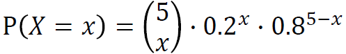

  - Tabulkou
  - Grafem

- Distribuční funkce má vztah s pravděpodobnostní funkcí:

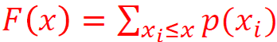

- Vizualizace hodnot pomocí histogramu:
  - x-ová osa intervaly naměřených hodnot
  - y-ová osa četnost dat
  - MATLAB: **histogram(x,M)**
    - x - naměřená data
    - M - skalár počet rovnoměrných sloupců v histogramu
    - M - vektor hraničních bodů
    - Obvyklý počet sloupců:
      - M = √n
      - M = 3.3×ln(n)
      - Pokud M není uvedeno, předpokládá se, že M=10
    - Další možnosti:
      - **histcounts(x)** - zjistí počet prvků v daném intervalu
      - **histogram2(x,y)** - 2D histogram
      - **histcounts2(x,y)** - zjistí počet prvků v 2D intervalu

## 3.3 Spojitá náhodná veličina

- Spojitá náhodná veličina nastává, jestliže množina výsledků náhodného pokusu nabývá všech hodnot z určitého intervalu (obecně nespočetný počet).
  - životnost výrobku, náhodně vybrané reálné číslo, přesně naměřený rozměr
- Má spojité rozdělení pravděpodobnosti právě tehdy, má-li spojitou distribuční funkci
  - Nelze použít pravdivostní funkci, protože pravděpodobnost intervalu o délce 0 je nulová
- Pro popis spojité náhodné veličiny se používá f(t).
- **Hustota pravděpodobnosti f(t)** spojité náhodné veličiny je reálná nezáporná funkce:

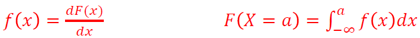

- Vlastnosti hustoty pravděpodobnosti:
  - f(x) ≥ 0 => hustota je nezáporná
  - ∫f(x)dx = 1; od -∞ do ∞ => plocha pod křivkou je rovna 1
  - lim(f(x)); x → ∞ = lim(f(x)); x → ∞
- Základní vlastnosti:
  - P(_a_ < X ≤ _b_) = ∫<sub>_a_</sub><sup>_b_</sup>f(x)dx
    - př. pravděpodobnost, že se výrobek porouchá v intervalu <_a_;_b_>
  - P(X ≤ _a_) = ∫<sub>-∞</sub><sup>_a_</sup>f(x)dx
    - Pravděpodobnost, že se výrobek porouchá do času _t_.
  - P(X > _a_) = ∫<sub>_a_</sub><sup>∞</sup>f(x)dx = 1 - ∫<sub>-∞</sub><sup>_a_</sup>f(x)dx
    - Pravděpodobnost, že životnost výrobku je delší než _a_.
-

## 3.4 Transformavce náhodné veličiny

## 3.5 Číselné charakteristiky náhodné veličiny

### 3.5.1 Úvod do číselných charakteristik

- Rozdělení pravděpodobnosti je jednoznačně popsáno
  - distribuční funkcí F(x)
  - hustotou pravděpodobnosti f(x) - spojití n.v.
  - pravděpodobnostní funkcí p(x) - diskrétní n.v
- Snahou je popsat rozdělení pomocí několika málo číse, které popisují hlavní charakteristiky náhodné veličiny
  - Střední hodnota E(X)
  - Rozptyl D(X)
  - Směrodatná odchylka 𝜎(X)

### 3.5.2 Obecné momenty

- Obecný moment r-tého řádu:
  - značí se E(X<sup>r</sup>), nebo 𝜇<sub>r</sub>
  - Pro diskrétní náhodnou veličinu:

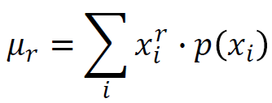

- Pro spojitou náhodnou veličinu:

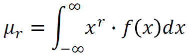

- Velmi často se využívá 1. obecný moment - Střední hodnota

### 3.5.3 Střední hodnota

- E(X), 1. obecný moment
- Interpretace - průměr všech realizací náhodné veličiny
- Vlastnosti střední hodnoty:
  - _E_(_aX_ + _b_) = _aE_(_X_) + _b_ ; ∀*a*, _b_
  - _E_(∑<sub>_i_</sub>_X<sub>i</sub>_) = ∑<sub>_i_</sub>_E_(_X<sub>i</sub>_)
  - _E_(∏<sub>_i_</sub>_X<sub>i</sub>_) = ∏<sub>_i_</sub>_E_(_X<sub>i</sub>_) ; jestliže _X<sub>i</sub>_ jsou navzájem nezávislé

### 3.5.4 Centrální momenty

- Centrální moment r-tého řádu:
  - značí se 𝜇<sub>r</sub>'
  - 𝜇<sub>r</sub>' = E(X - E(X))<sup>r</sup> pro r=2,3,4,...
  - Pro diskrétní náhodnou veličinu:

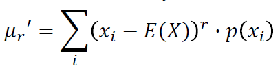

- Pro spojitou náhodnou veličinu

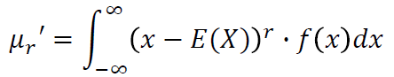

- Velmi často se využívá 2. centrílní moment - rozptyl, nebo jeho odmocnina směrodatná odchylka
- Využívá se i 3. a 4. centrální moment - šikmost, špičatost

### 3.5.5 Rozptyl a směrodatná odchylka

- D(X) nebo také 𝜎<sup>2</sup>, 2. centrální moment
- Rozptyl je parametr vyjadřující variabilitu (rozptálenost) realizací od střední hodnoty
- Jednostkou rozptylu je kvadrát střední hodnoty
- Vlastnosti:
- D(aX + b) = a<sup>2</sup>D(X) ; ∀a,b
- D(∑<sub>i</sub>X<sub>i</sub>) = ∑<sub>i</sub>D(X<sub>i</sub>) jestliže X<sub>i</sub> jsou navzájem nezávislé
- Z důvodů nevhodných jednotek se využívá odmocnina z rozptylu - Smerodatná odchylka 𝜎

```
𝜎 = √(𝜎^2) = √D(X)
```

- Směrodatná odchylka je obdobně jako rozptyl parametr vyjadřující variabilitu dat od střední hodnoty

### 3.5.6 Šiknost

- mira symetrie rozdělení pravděpodobnosti
- Definována jako podím 3. centrálního momentu a třetí mocniny směrodatné odchylky

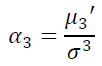

- 𝛼<sub>3</sub> = 0 symetrické rozdělení
- 𝛼<sub>3</sub> < 0 negativně zešikmené rozdělení
- 𝛼<sub>3</sub> > 0 pozitivně zešikmené rozdělení

### 3.5.7 Špičatost

- mira koncentrace kolem střední hodnoty
- Definována podílem 4. centrálního momentu a čtvrté mocniny směrodatné odchylky

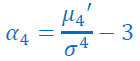

- 𝛼<sub>4</sub> = 0 špičatost normálního rozdělení
- 𝛼<sub>4</sub> < 0 menší špičatost než u normálního rozdělení
- 𝛼<sub>4</sub> > 0 větší špičatost než u normálního rozdělení
- V některé literatuře je koeficient špičatosti definován odlišně (bez -3)

### 3.5.8 Kavntily

- značí se x<sub>p</sub>
- Představuje takovou hodnotu, že pravděpodobnost, že náhodná veličina nabude hodnoty menší než x<sub>p</sub> je 100×p procent
- 50% kvantil je nazýván medián
- 25% a 75% kvantil je nazýván dolní/horní kvartil
- 1% kvantil je nazýván percentil

### 3.5.9 Modus

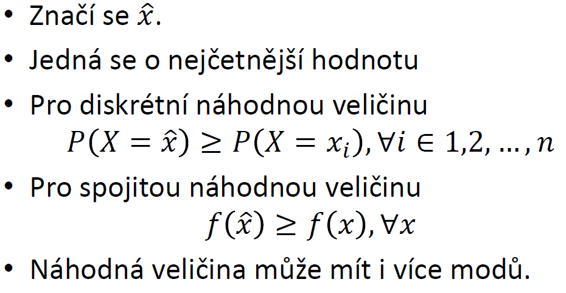

## 3.6 Charakteristiky numerických proměnných

### 3.6.1 Základní charakteristiky

- maximum - max(x)
- minimum - min(x)
- rozdíl maxima a minima - range(x)
- Součet prvků - sum(x)
- rozsah výběru - length(x), size(x)

### 3.6.2 Aritmetický průměr

- Vlastnosti střední hodnoty:
  - Přičteme-li všem datům konstantu c, střední hodnota se zvýší o konstantu c.
  - Vynásobíme-li všechna data konstantou c, střední hodnota se c-krát zvýší

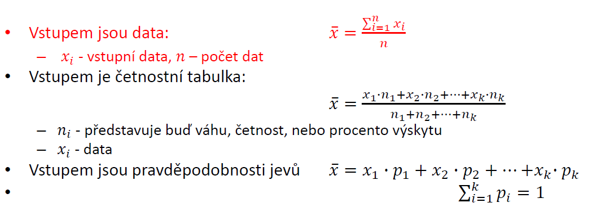

- MATLAB: mean(x), nanmean(x)

### 3.6.3 Harmonický a geometrický průměr

- Harmonický průměr
  - Pro výpočet průměru převrácených hodnot
  - Využití pro úlohy s nepřímou úměrností (úlohy práce)
  - MATLAB: **harmmean(x)**

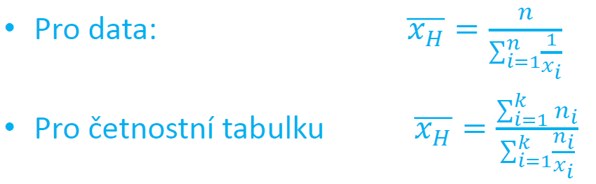

- Geometrický průměr
  - Pro výpočet průměru představující relativní změny
  - MATLAB: **geomean(x)**

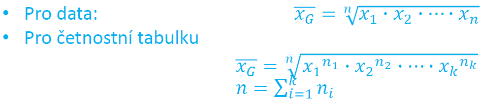

### 3.6.4 Modus a shorth

- Modus je nejčastější hodnota
  - značí se x se stříškou
  - MATLAB: **mode(x)** - při více modů vrací první
- Shorth je nejmenší interval, v němž leží alespoň 50% vstupních dat

### 3.6.5 Kvantily, kvartily a medián

- Kvantil
  - 100×p % kvantil proměnné x je hodnota, která rozděluje soubor na 100×p % menších hodnot od zbytku
  - značí se x<sub>p</sub>
  - Kvantily tvoří inverzní funkci k distribuční funkci
- Kvartily
  - 75% kvantil se nazývá horní **kvartil**
  - 25% kvantil se nazývá dolní **kvartil**
- Medián
  - 50% kvantil se nazývá **medián**
  - rozděluje data na dvě skupiny takové, že v první je 50% dat menších než medián a v druhé je 50% dat větších než medián
- Určení z naměřených dat
  - 100p% kvantil je roven proměnné s pořadím: z<sub>p</sub> = n × p + 0.5
  - Není-li z<sub>p</sub> celé číslo, pak kvantil určíme jako průměr prvků z pořadím

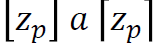

- Interkvartilové rozpětí
  - rozdíl mezi horním a dolním kvartilem
  - Pomocí interkvartilového rozpětí lze porovnávat variabilita souboru
- MATLAB:
  - **median(x)**, **nanmedian(x)** - x<sub>0.5</sub> určí medián z vektoru
  - **quantile(x, p)** - určí p kvantil z dat, např. quantile(x, 0.5) je 50% kvantile
  - **prctile(x, p)** - x<sub>p</sub> určí p% kvantil z dat; např. prctile(x,50) je 50% kvantil
  - **iqr(x)** - interkvantilové rozpětí

### 3.6.6 Výběrový rozptyl, směrodatná odchylka

- výběrový rozptyl a směrodatná odchylka popisují variabilitu dat kolem střední hodnoty
- Výpočet výběrového rozptylu:
  - 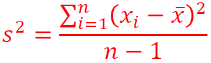
  - čitatel je součet kvadrátů odchylek od průměrů
  - Jmenovatel je zmenšen o 1, protože se ztrácí jeden stupeň volnosti odhadem střední hodnoty
  - Ve statistice se často, když odhadujeme k parametrů zmenší počet volnosti o k => n - k, kde n je počet naměřených dat
- Základní vlastnostivýběrového rozptylu
  - Konstantní hodnoty mají nulový rozptyl
  - Přičtením konstanty ke všem datům se rozptyl nezmění
  - Vynásobíme-li data konstantou k, rozptyl se změní k<sup>2</sup> krát
- Navýhoda rozptylu je, že jednotky jsou v kvadrátu oproti střední hodnotě
  - odstraňuje směrodatná odchylka
- Směrodatná odchylka: s = √rozptylu
- MATLAB:
  - **moment(x,řád momentu)** - určení libovolného centrálního momentu
  - **var(x)** - Výběrový rozptyl
  - **std(x)** - Výběrová směrodatná odchylka
- Variační koeficient
  - Vhodný pro porovnání míry variability mezi sebou
  - Použitelný pouze pro kladněnaměřené hodnoty (záporné výsledky nemohou nastat)
  - V<sub>x</sub> = s/x

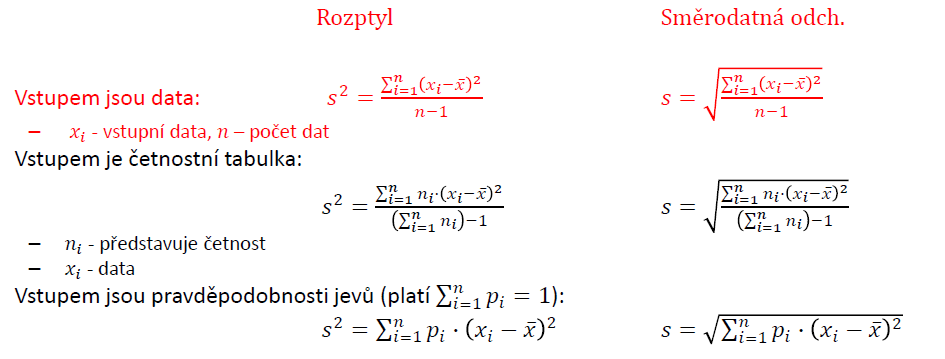

### 3.6.7 MAD

- Střední hodnota absolutních odchylek od střední hodnoty
- Medián absolutních odchylek od mediánu
- MATLAB:
  - **mad(x, 0)** - střední hodnota absolutních odchylek od střední hodnoty
  - **mad(x, 1)** - medián absolutních odchylek od mediánu

### 3.6.8 Výběrová šikmost

- Vyjadřuje symetrii rozložení hodnot kolem průměru
  - a = 0 - data jsou kolem průměru rozloženy symetricky
  - 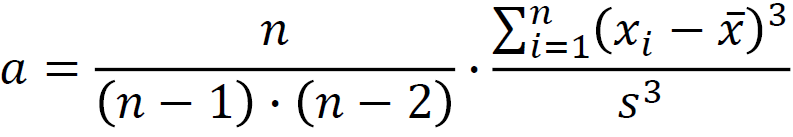
- MATLAB: **skewness(x)**
  - 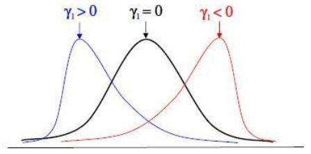

### 3.6.9 Výběrová špičatost

- Vyjadřuje koncentraci naměřených hodnot kolem jejího průměru a porovnává je s normálním rozdělením
  - b = 0 - špičatost odpovídá normálnímu rozdělení
  - 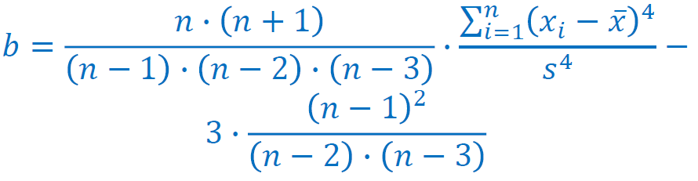
- MATLAB: **kurtosis(x)**
  - 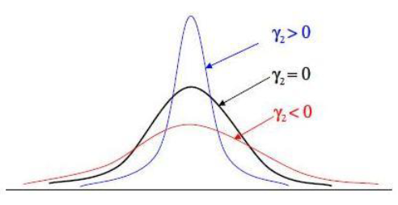

## 3.7 Identifikaceodlehlých měření

- důležité pro zjištění těch hodnot, které se mimořádně liší od ostatních a ovlivňují tím vypovídající hodnotu průměru
- U všech identifikovaných dat je vhodné se zamyslet, zda nedošlo k chybě měření
- Práce s odlehlými daty:
  - byla zjištěna chyba při měření => data odstraníme
  - nebyla zjištěna chyba při měření => data ponecháme a zdůvodníme jejich ponechání
  - nemyla zjištěna chyba při měření => data odstraníme a zdůvodníme jejich odstranění a uvedeme důvod proč nebyly ponechány
- Způsob zjištění odlehlých měření:
  - Metoda z-souřadnice
    - Data z normálního rozdělení, symetrická
    - 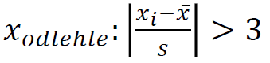
  - Metoda vnitřních hradeb
    - nesymetrická data
    - 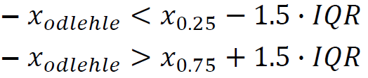

## 3.8 Příkazy v MATLABu
