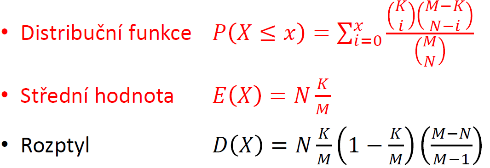

# 4. Diskrétní rozdělení pravděpodobnosti

## 4.1 Hypergeometrické rozdělení

- používá se v situacích, kdy je třeba vypočítat pravděpodobnost určitého počtu úspěchů v n závislých pokusech
- Závislé pokusy
  - pokusy bez vracení, podmínky pokusů jsou odlišné
- Vzorec:

- (K nad x) - počet kombinací, jak lze vybrat x prvků s danou vlastností, z celkově K prvků s danou vlastností
- (M-K nad N-x) - počet kombinací, jak lze vybrat N-x prvků bez dané vlastnosti z celkového množství M-K, kde M je počet všech prvků
- (M nad N) - počet kombinací, jak lze vybrat N-tici z M prvků
- čitatel => počet příznivých pokusů
- jmenovatel => počet všech pokusů

- MATLAB:
  - - x - počet vybraných prvků s danou vlastností
    - K - celkový počet prvků s danou vlastností
    - M - celkový počet prvků
    - N - počet vybraných prvků
  - Distribuční funkce - **F=hygecdf(x,M,KN)**
  - pravděpodobnostní funkce - **F=hygepdf(x,M,K,N)**
  - inverzní distribuční funkce - **x=hygeinv(pravd,M,K,N)**
  - stanovení střední hodnoty a rozptylu - **[MN,var]=hygestat(M,K,N)**
  - Náhodná čísla z hyperg. rozdělení - **R=hygernd(M,K,N,m,n)** - m,n - matice náhodných čísel o rozměru m×n
  - - x - počet vybraných prvků s danou vlastností
    - K - celkový počet prvků s danou vlastností
    - M - celkový počet prvků
    - N - počet vybraných prvků

## 4.2 Binomické rozdělení

- používá se v situacích, kdy je třeba vypočítat pravděpodobnost určitého počtu úspěchů v n nezávislých pokusech
- Nezávislé pokusy
  - pokusy s vracením, podmínky jsou vždy stejné
- Vzorec

- n - počet náhodných pokusů
- p = pravděpodobnost úspěšného pokusu
- k - počet úspěšných pokusů
- (n nad k) - počet kombinací, kolika zbůsoby můžeme vytvořit z n prvků k-tice
- pk - pravděpodobnost úspěchu, který se opakuje k-krát
- (1-p)n-k - pravděpodobnost neúspěchu, který se opakuje n-k krát
- (n nad k)pk - tvoří kombinatorické pravidlo součinu

- MATLAB:
  - - k - počet úspěšných pokusů
    - n - počet celkových pokusů
    - p - pravděpodobnost
  - Distribuční funkce - **F=binocdf(k,n,p)**
  - pravděpodobnostní funkce - **F=binopdf(k,n,p)**
  - inverzní distribuční funkce - **x=binoinv(pravd,n,p)**
  - stanovení střední hodnoty a rozptylu - **[MN,var]=binostat(n,p)**
  - náhodná čísla z binomického rozdělení - **R=binornd(n,p)**
  - odhad parametrů rozdělení - **p=binofit(k,n)**

## 4.3 Rozdělení odvozená z binomického rozdělení

### 4.3.1 Alternativní rozdělení

- popisuje pravděpodobnost jednoho náhodného pokusu
- binomické rozdělení, kde parametr n = 1

### 4.3.2 Geometrické rozdělení

- popisuje počet neúspěšných pokusů, před prvním úspěchem
  - Prvních n pokusů je neúspěšných, n+1 pokus je úspěšný
  - pravděpodobnost je součinem dvou binomických rozdělení. První určuje pravděpodobnost neúspěchů v n pokusech, druhé pravděpodobnost úspěchu v n+1 pokusu (alternativní rozdělení)

- MATLAB
  - - X je počet neúspěšných pokusů
    - p je pravděpodobnost
  - Distribuční funkce - **F=geocdf(X,p)**
  - pravděpodobnostní funkce - **P=geopdf(X,p)**
  - Inverzní distribuční funkce - **x=geoinv(pravd,p)**
  - Stanovení střední hodnoty a rozptylu - [M,var]=geostat(p)\*\*
  - Náhodná čísla z geometrického rozdělení - **geornd(p)**

### 4.3.3 Negativně binomické rozdělení

- popisuje počet neúspěšných pokusů n, které předcházejí k-tému výskytu události
  - zobecnění Geometrického rozdělení
  - prvních n+k-1 pokusů má k-1 úspěchů, právě n+k pokus je úspěšný
  - pravděpodobnost je součinem dvou binomických rozdělení. Prvníurčuje pravděpodobnost k-1 úspěchů v n+k-1 pokusech, druhé pravděpodobnost úspěchu v n+k pokusu

- MATLAB:
  - - n - počet neúspěšných pokusů
    - k - počet úspěšných pokusů
    - p - pravděpodobnost úspěšného pokusu
  - Distribuční funkce - **F=nbincdf(n,k,p)**
  - Pravděpodobnostní funkce - **P=nbincdf(n,k,p)**
  - Inverzní funkce - **x=nbininv(pravd,k,p)**
  - Stanovení střední hodnoty a rozptylu - **[M,var]=nbinstat(k,p)**
  - Náhodná čísla z negativně binomického rozdělení - **nbinrnd(k,p)**

## 4.4 Multinomické rozdělení

- používá se v situacích, kdy je třeba vypočítat pravděpodobnost určitého počtu více jevů v n nezávislých pokusech
- Rozšíření binomického rozdělení o více druhů výsledků
  - Není již ano/ne, ale více druhů (např. hrací kostka: 1, 2, 3, 4, 5, 6)
- Předpoklady: nezávislé pokusy, musí nastat právě jeden z jevů
- Pravděpodobnostní funkce:

- MATLAB:
  - **mnpdf(četnost, pravděpodobnost)**
    - četnost - vektor s uvedením četností výsledků
    - pravděpodobnost - vektor pravděpodobností jevů
  - **mnrnd(počet prvků, pravděpodobnost)**
    - počet prvků - počet vygenerovaných prvků
    - pravděpodobnost - vektor pravděpodobností jevů

### 4.4.1 Příklad

- házíme 6× kostkou. Jaká je pravděpodobnost, že hodíme právě každé číslo 1×?
  - mnpdf([1,1,1,1,1,1],[1/6,1/6,1/6,1/6,1/6,1/6])
- Házíme 21× kostkou. Jaká je pravděpodobnost, že hodíme právě 1× jedničku, 2× 2, 3× 3, 4× 4, 5× 5 a 6× 6?
  - mnpdf([1,2,3,4,5,6],[1/6,1/6,1/6,1/6,1/6,1/6])

### 4.4.2 Multi-Hypergeometrické rozdělení

- závislé pokusy vychází z hypergeometrického rozdělení
- pravděpodobnostní funkce:

## 4.5 Poissonovo rozdělení

- Poissonův proces popisuje počet náhodných událostí v nějakém pevném intervalu
- Předpoklady:
  - Pravděpodobnost, že nastane více jevů v limitně krátkém čase je nulová
  - Pravděpodobnost výskytu jevu závisí na délce intervalu, nikoliv na okamžiku jeho začátku
  - Počty událostí ve vzájemně disjunktních intervalech jsou nezávislé
- Parametr Poissonova procesu je intenzita λ náhodného jevu
  - počet jevů za jednotku času
  - základní jednotky intezity - hod-1, km-1, ks-1
  - Součin λ×t je bezrozměrná veličina, kzterá je základním parametrem Poissonova procesu
- Jestliže se definuje náhodný pokus jako Poissonův proces s intenzitou λ, potom náhodnou veličinu X lze definovat jako počet výskytů události v časovém intervalu délky t. Náhodná veličina X se popisuje Poissonovým rozdělením s parametrem λt.

- MATLAB:
  - - X - počet pokusů
    - λ - intenzita náhodného jevu
    - lambda = λ×t
  - Distribuční funkce - **F=poisscdf(X,lambda)**
  - Pravděpodobnostní funkce - **P=poisspdf(X,lambda)**
  - Inverzní distribuční funkce - **x=poissinv(pravd,lambda)**
  - Stanovení střední hodnotya rozptyliu - **[M,var]=poisstat(lambda)**
  - Náhodná čísla z Poissonova rozdělení - **poissrnd(lambda)**
  - Stanovení parametru lambda z dat - **poissfit(data)**

## 4.6 Aproximace diskrétních rozdělení

- Aproximace hypergeometrického rozdělení binomickým
  - Hypergeometrické rozdělení - závislé pokusy
    - x - počet vybraných prvků s danou vlastností
    - K - celkový počet prvků s danou vlastností
    - M - celkový počet prvků
    - N - počet vybraných prvků
  - Binomické rozdělení - nezávislé pokusy
    - n - počet náhodných pokusů
    - p - pravděpodobnost úspěšného pokusu
    - k - počet úspěšného pokusu
  - Je-li N/M menší než 0.05, lze hypergeometrické rozdělení nahradit binomickým s parametry:
    - n = N
    - p = K/M
    - k = x
- Aprocimace binomického rozdělení Poissonovým
  - binomické rozdělení - nezávislé pokusy
    - n - počet náhodných pokusů
    - p - pravděpodobnost úspěšného pokusu
    - k - počet úspěšného pokusu
  - Poissonovo - poissonův proces
    - λt - intenzita náhodného jevu
  - Poissonovým rozdělením lze aproximovat binomické, jestliže n je větší než 30 a p<0.05
    - λt = n×p
