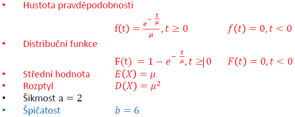
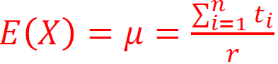
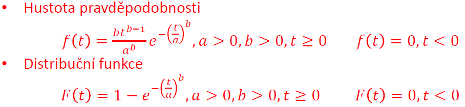
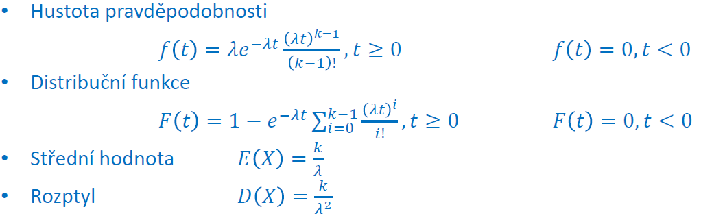
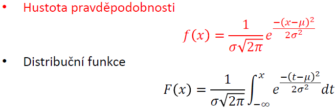
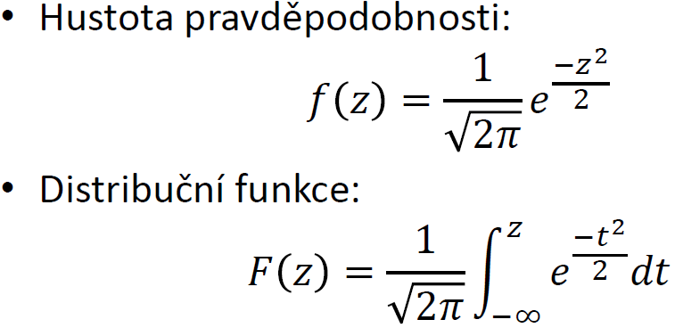
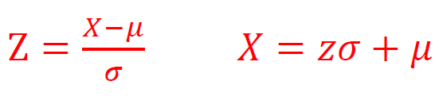
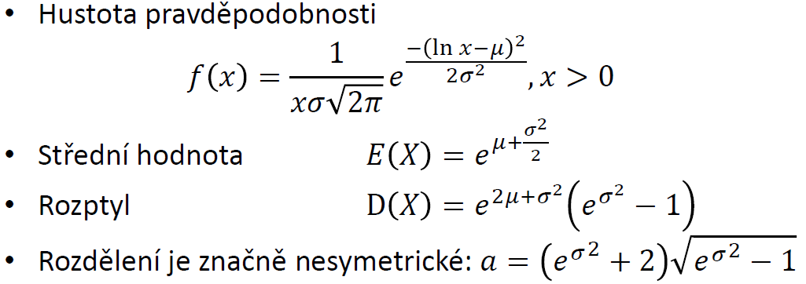

# 5. Spojitá rozdělení pravděpodobnosti

## 5.1 Rovnoměrné rozdělení

- má konstantní hodnotu pravděpodobnosti na intervalu <a,b>
- Speciální případ je funkce náhodné číslo, která je definována na intervalu <0,1>
- Hustota pravděpodobnosti: f(x) = 1/(b-a) na intervalu <a,b>, jinde f(x) = 0
- Distribuční funkce:
  - F(x) = (x - a)/(b - a); a < x < b
  - F(x) = 0; x < a
  - F(x) = 1; x > b
- Střední hodnota : E(x) = (a + b)/2
- Rozptyl: D(x) = (a - b)2/12
- Šikmost: a = 0 (je symetrické)
- Špičatost: b = 9/5
- MATLAB:
  - - x - parametr
    - a,b - minimum a maximum rovnoměrného rozdělení
  - Distribuční funkce - **F=unifcdf(x,a,b)**
  - Hustota pravděpodobnosti - **f=unifpdf(x,a,b)**
  - Inverze distribuční funkce - **x=unifinv(pravd,a,b)**
  - Odhad parametrů - **[a,b]=unifit(data)**
  - Stanovení střední hodnoty a rozptylů - **[m,v]=unifstat(a,b)**
  - Náhodné číslo v matici o velikost m×n - **R=unifrnd(a,b,m,n)**

## 5.2 Exponenciální rozdělení

- používá se pro popis doby do první události Poissonova procesu s intenzitou náhodného jevu λ, nebo s její převrácenou hodnotou 𝜇
- Souvislost s Poissonvým rozdělením
  - Poissonovo rozdělení - pravděpodobnost počtu událostí za dobu t
  - Exponenciální rozdělení - pravděpodobnost, že první událost nastane do doby t
- Aplikovatelnost:
  - Neměnná intenzita náhodného jevu na čase
  - Doba do poruchy nedegradujících výrobků
  - Teorie front (doba čekání ve frontě)
- Obecné použití
  - Rozdělení bez paměti
  - rozpad radioaktivních látek
  - Nabíjení vybíjení kondenzátoru
  - řešení obyčejných diferenciálních rovnic 1. řádu

- 𝜇 - parametr exponenciálního rozdělení
- V torii spolehlivosti se místo střední hodnoty 𝜇 používá její převrácená hodnota představující intenzitu poruch λ
- Počítání s intenzitami má ve spolehlivosti výhodu při řazení komponent do větších funkčních celků
- MATLAB:
  - Distribuční funkce - **F=expcdf(x,𝜇)**
  - Hustota pravděpodobnosti - **f=exppdf(x,𝜇)**
  - Inverze distribuční funkce - **x=expinv(pravd,𝜇)**
  - Odhad parametrů - **[a,b]=expfit(data)**
  - Stanovení střední hodnoty a rozptylů - **[m,v]=expstat(𝜇)**
  - Náhodné číslo v matici o velikost m×n - **R=exprnd(𝜇,m,n)**
- Zjištění parametrů exponenciálního rozdělení pro data o poruchách výrobků
  - zkouška je ukončena časem nebo chybou

- ti doba do poruchy nebo doba do ukončení zkoušky
- n - počet výrobků
- r - počet poruch
- **EX=expfit(x,alpha,cens,freq)**
  - EX = vypočtená střední hodnota
  - x = doba, kdy došlo k poruše nebo ukončení zkoušky
  - alpha - viz kapitola 8, zatím 0.05
  - cens - způsob ukončení zkoušky, 0 = porucha, 1 = čas
  - freq - počet výskytů
  - Vektory x, cens a freq musí být stejně dlouhé

## 5.3 Weibullovo rozdělení

- slouží kmodelování doby do poruch zařízení
- Narozdíl od exponenciálního je obecnější, protože popisuje i degradující komponenty a tím nevyžaduje konstantní intenzitu náhodného jevu
- obsahuje 2 parametry
  - a - parametr měřítka
  - b - parametr tvaru

- b = 0, přechází Weibullovo rozdělení na exponenciální
- b < 1, pro popis doby do poruchy výrobků, kde se projevují časné poruchy
- b > 1, pro popis doby do poruchy výrobků, kde se projevují poruchy z opotřebení
- Čím větší je parametr b, tím pozvolněji dochází k nástupu poruch
- naopak rychleji dochází k poškozování výrobků v období degradace

- MATLAB:
  - - t - parametr
    - a - parametr měřítka
    - b - parametr tvaru
  - Distribuční funkce - **F=wblcdf(t,a,b)**
  - Hustota pravděpodobnosti - **f=wblpdf(t,a,b)**
  - Inverze distribuční funkce - **x=wblinv(pravd,a,b)**
  - Odhad parametrů - **a=wblfit(data)**
  - Stanovení střední hodnoty a rozptylů - **[m,v]=wblstat(a,b)**
  - Náhodné číslo - **wblrnd(a,b)**
- Zjištění parametrů Weibullova rozdělení pro data o poruchách výrobků
  - ti - poba do poruchy, nebo doba do ukončení
  - n - počet výrobků
  - r - počet poruch
  - **par=wblfit(x,alpha,cens,freq)**
    - par - vypočtené parametry Weibullova rozdělení
    - x - doba, kdy došlo k poruše nebo ukončení
    - alpha - viz kapitola 8, zatím 0.05
    - cens - způsob ukončení zkoušky, 0porucha, 1 časem
    - freq - počet výskytů
    - Vektory x, cens a freq musí být stejně dlouhé

## 5.4 Erlangovo (Gamma) rozdělení

- popisuje v Poissonově procesu dobu do k-té poruchy
- odvozeno z exponenciálního rozdělení
- obsahuje dva parametry
  - 1/λ - střední doba do poruchy
  - k - k-tý počet poruch
- Hustoru pravděpodobnosti lze získat konvolucí exponenciálního rzdělení (složité)

- MATLAB:
  - - t - parametr
    - k - kolikátá událost
    - b - parametr měřítka t = 1/λ
  - Distribuční funkce - **F=gamcdf(t,k,b)**
  - Hustota pravděpodobnosti - **f=gampdf(t,k,b)**
  - Inverze distribuční funkce - **x=gaminv(pravd,k,b)**
  - Odhad parametrů - **[k,b]=gamfit(data)**
  - Stanovení střední hodnoty a rozptylů - **[m,v]=gamstat(k,b)**
  - Náhodné číslo - **gamrnd(k,b)**

## 5.5 Normální rozdělení

- někdy Gaussovo rozdělení
- Nejpoužívanější pravděpodobnostní rozdělení
- použití pro popis náhodných veličin, které lze interpretovat jako sumární výsledek mnoha nepatrných a vzájemně nezávislých vlivů
- Za určitých podmínek lze pomocí norm. rozd. aproximovat řadu jiných spojitých i nespojitých rozdělení
- má dva parametry:
  - 𝜇 - střední hodnota
  - 𝜎2 - rozptyl
    - nebo 𝜎 - směrodatná odchylka → 𝜎 = √(𝜎2)
- Jestliže jsou data z normálního rozdělení, tak zapisujeme N(𝜇,𝜎2)

- střední hodnota E(X) = 𝜇
- Rozptyl D(X) = 𝜎2
- Šikmost a = 0 - rozdělení je symetrické
- Špičatost b = 3
  - může nabývat pouze nezáporných jhodnot, proto se často od výsledku odečítá 3, aby byla rovná 0
- Změna střední hodnoty posune hustotu rozdělení, bez změny jejího tvaru
- Změna směrodatné odchylky zvětší/zmenší hustotu rozdělení, bez změny střední hodnoty
- MATLAB:
  - - x - parametr
    - 𝜇 - střední hodnota
    - 𝜎 - směrodatná odchylka, !!!nikoli rozptyl!!!
  - Distribuční funkce - **F=normcdf(x,𝜇,𝜎)**
  - Hustota pravděpodobnosti - **f=normpdf(x,𝜇,𝜎)**
  - Inverze distribuční funkce - **x=norminv(pravd,𝜇,𝜎)**
  - Odhad parametrů - **[𝜇,𝜎]=normfit(data)**
  - Stanovení střední hodnoty a rozptylů - **[𝜇,𝜎]=normstat(𝜇,𝜎)**
  - Náhodné číslo - **R=normrnd(𝜇,𝜎)**

## 5.6 Normované normální rozdělení

- speciální případ normálního rozdělení, kdy střední hodnota 𝜇 = 0 a rozptyl 𝜎2 = 1
- využití:
  - jednoduchý převod z normálních rozdělení a jejich vzájemné porovnání
  - funkce je tabelována a lze pomocí ní provést výpočet distribuční funkce s obecnými parametry
  - velký význam zejména ve statistice

- Hustota pravděpodobnosti je někdy označována 𝜑(z)
- Distribuční funkce je někdy označována Θ(z)
- Normování normálního rozdělení
  - Náhodná veličina X → N(𝜇,𝜎2) lze přetransformovat na náhodnou veličinu X → N(0,1) pomocí transformace Z = (X - 𝜇)/𝜎
- K transformaci dat na normované normální rozdělení se používá výše uvedené transformace, a výsledek se nazývá z-skóre
- Převedení libovolného normálního rozdělení na normované normální rozdělení:

- Pro normální rozdělení platí, že vzdálenostem o z𝜎 odpovídá hodnota distribuční funkce

## 5.7 Logaritmicko-normální rozdělení

- vznikne, jestliže náhodnou veličinu X s normálním rozdělením transformujeme na Y = eX
- Použití pro popis náhodných veličin, které lze interpretovat jako multiplikativní výsledek mnoha nepatrných a vzájemně nezávislých vlivů
- data jsou z logarotmicko-normálního rozdělení zapisujeme LN(𝜇,𝜎2)
- často data zlogaritmujeme a potom se k nim chováme jako z normálního rozdělení

- MATLAB:
  - - x - parametr
    - 𝜇 - střední hodnota normálního rozdělení
    - 𝜎 - směrodatná odchylka normálního rozdělení
  - Distribuční funkce - **F=logncdf(x,𝜇,𝜎)**
  - Hustota pravděpodobnosti - **f=lognpdf(x,𝜇,𝜎)**
  - Inverze distribuční funkce - **x=logninv(pravd,𝜇,𝜎)**
  - Odhad parametrů - **[𝜇,𝜎]=lognfit(data)**
  - Stanovení střední hodnoty a rozptylů - **[𝜇,𝜎]=lognstat(𝜇,𝜎)**
  - Náhodné číslo - **lognrnd(𝜇,𝜎)**

## 5.8 Grafické ověření, že data pochází z určitého spojitého rozdělení

### 5.8.1 Empirická distribuční funkce

- Lze použít:
  - Odečtení kvantilů náhodné proměnné
  - ověření, zda data mohou být z určitého rozdělení
- Získání empirické distribuční funkce:
  - setřídit data od min po max
  - Fx =
    - = 0, x < x1
    - = i/n, xi ≤ x < xi+1
    - = 1, x > xn
  - empirickou distribuční funkci graficky zobrazíme
- MATLAB: **cdfplot(x)**
  - Lze využít i funkce **ecdf**, která poskytuje i další textové výsledky

### 5.8.2 Weibullův pravděpodobnostní papír

- Umožňuje opticky určit, zda data mohou pocházet z exponenciálního nebo Weibullova rozdělení
- Základní princip
  - x-ová osa - časy naměřené hodnoty/události
  - y-ová osa -pravděpodobnost hypotetické distribuční funkce
  - křížky - naměřené hodnoty
  - červená přerušovaná čára - proložení přímkou
    - podle sklonu a polohy lze zjistit parametry daného rozdělení
  - Křížky leží v blízkosti červené čáry => data pocházejí z daného rozdělení
  - Křížky netvoří přímku - data nelze proložit daným typem rozdělení
- MATLAB: **wblplot(data)**

### 5.8.3 Normální pravděpodobnostní papír

- obdobný princip jako u Weibullova pravděpodobnostního papíru
- MATLAB: **normplot(data)**

### 5.8.4 Obecný pravděpodobnostní papír

- Pravděpodobnostní papíry i pro další rozdělení
- MATLAB: **probplot(typ rozdělení, data)**
  - typy rozdělení:
    - Exponenciální - 'exponential'
    - Lognormální - 'lognormal'
    - Normální - 'normal'
    - Weibullovo - 'weibull'

### 5.8.5 QQ plot

- umožňuje stanovit, zda data pochází z normálního rozdělení
  - x-ová osa - teoretické z-skore normovaného normálního rozdělení
  - y-ová osa - naměřená data
- MATLAB: **qqplot(data)**
- Jestliže data jsou na přímce, jsou z normálního rozdělení
- Výsledky:
  - Normální rozdělení - přímka
  - Normální rozdělení s odlehlými daty - přímka s koncovými daty mimo přímku
  - Kladná šikmost - konvexní tvar
  - Záporná šikmost - konkávní tvar
  - Vyšší špičatost než normální rozdělení - konkávní pak konvexní tvar
  - Nižší špičatost než normální rozdělení - konvexní pak konkávní tvar
    - Je vidět, pokud mají data nulovou nebo skoro nulovou šikmost

### 5.8.6 Krabicový graf

- využití pro rychlé zobrazení:
  - Mediánu
  - Dolního a horního kvartilu
  - Minima a maxima
  - Odlehlých dat
- lze odhadnout
  - velikost rozptylu - z interkvartilového rozpětí
  - Symetrii
    - shoda průměru a mediánu
    - Rozdíl x0.75 - x0.5 ≈ x0.5 - x0.25
- MATLAB: **boxplot(x)**
- Při více náhodných výběrů lze pomocí krabicového grafu stanovit trend středních hodnot a velikost rozptylu
  - **boxplot(x,y)**
    - x - vektor naměřených hodnot
    - y - vektor k jakému měření hodnoty patří
    - Př:x=[1 2,3,4,5,6,7, 8,9,10], y=[1,1,1,1,1,1,1, 2,2,2]
