# 6. Výběrové charakteristiky

## 6.1 Výběrové charakteristiky

- Pravděpodobnost
  - Pravděpodobnost každého jevu je předem dána a je neměnná - konstantní hodnota
    - Hod mincí, 50% panna, 50% orel
  - Výseledek - pravděpodobnost že v 10 náhodných pokusech nastane úspěch právě k-krát
  - Charakteristiky: střední hodnota, rozptyl, směrodatná odchylka, medián, pravděpodobnost
- Statistika
  - Pravděpodobnost úspěchu jevu se snažíme zjistit za pomoci naměřených dat - stochastická hodnota
    - Střední doba do poruchy n výrobků
    - Průměrný plat 20 pracujících v ČR
  - Obdržíme výběrové statistiky
    - Výběrová střední hodnota, výběrový rozptyl, výběrová směrodatná odchylka, výběrový medián, relativní četnost

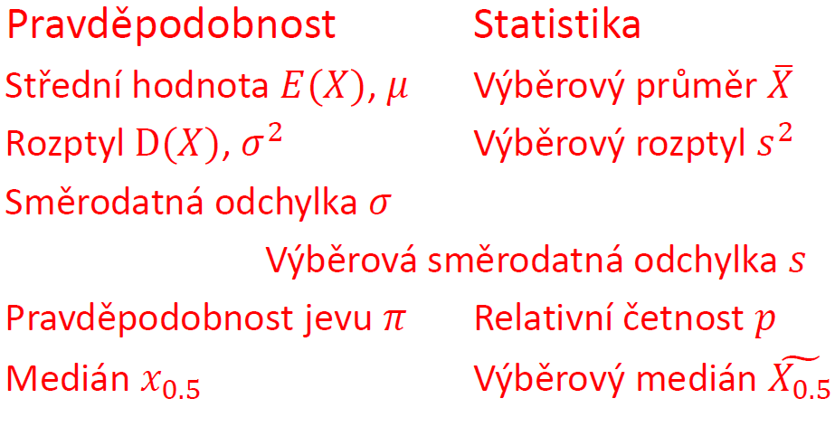

## 6.2 Výběrový průměr

- Mějme náhodný výběr X1,X2,...,Xn z náhodné veličiny X s distribuční funkcí F(x). Označme 𝜇x střední hodnotu a 𝜎x směrodatnou odchylku náhodné veličiny Xi. Potom výběrový průměr náhodného výběru rozumíme náhodnou veličinu:

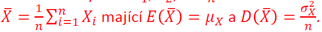

- Předpoklady:
  - dvojice náhodných veličin jsou nezávislé
  - Všechny náhodné veličiny Xi mají stejnou a konečnou střední hodnotu i směrodatnou odchylku
- Prochází-li náhodný výběr z normálního rozdělení N(𝜇x, 𝜎x2), pak výběrový průměr má normální rozdělení s parametry N(𝜇x, 𝜎x2/n)

## 6.3 Limitní věty

### 6.3.1 Zákon velkých čísel

- Jestliže výběr pochází z normálního rozdělení, pak s rostoucím rozsahem výběru se výběrový průměr soustřeďuje kolem střední hodnoty. (vlastnost výběrového průměru)
- mějme nekonečný výběr z rozdělení se střední hodnotou 𝜇x a konečným rozptylem 𝜎x2 kde jsou nezávislé náhodné veličiny. Potom platí, že výběrový průměr vypočítaný z prvních n pozorování se pro n→∞ blíží k hodnotě 𝜇x.

### 6.3.2 Centrální limitní věta

- Součet náhodných veličin
  - Rozšiřuje zákon velkých čísel o tvrzení, že za určitých podmínek lze součet náhodných veličin, nebo výběrový průměr popsat pomocí normálního rozdělení
  - Mějme nezávislé náhodné veličiny ze stejného rozdělení se stejnou střední hodnotou a s konečným rozptylem. Pak součet n náhodných veličin má při dostatečně velkém počtu pozorování přibližně normální rozdělení, ať pochází z libovolného rozdělení. Normální rozdělení má parametry:

- obvykle se takto označují výběry o rozsahu 30+
- pro výběrové rozdělení symetrick, unimodální, které obsahuje odlehlá pozorování stačí výběr o rozsahu min 15 dat

---

- Výběrový průměr
- Mějme nezávislé náhodné veličiny ze stejného rozdělení se stejnou střední hodnotou a s konečným rozptylem. Pak výběrový průměr má při dostatečně velkém počtu pozorování přibližně normální rozdělení, Ať náhodná veličina pochází z libovolného rozdělení. Normální rozdělení má parametry:

---

- Ljapunovova věta - součet náhodných veličin
- Mějme nezávislé náhodné veličiny ze stejného rozdělení se stejnou střední hodnotou a s konečným rozptylem a nechť platí podmínka symetrie, pak při dostatečně velkém počtu má součet náhodných veličin přibližně normální rozdělení,které má parametr:

### 6.3.3 Příklady na centrální limitní větu

Nebudu zde uvádět

## 6.4 Rozdíl výběrovách průměrů

- Mějme náhodný výběr X11,X12,...,X1n1 z rozdělení se střední hodnotou 𝜇1 a náhodný výběr X21,X22,...,X2n2 z rozdělení se střední hodnotou 𝜇2. Při splnění požadavků uvedených níže, má rozdíl výběrových průměrů následující vlastnosti:

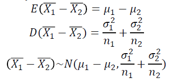

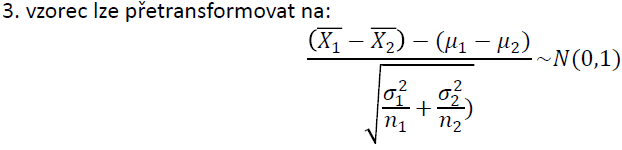

- Předpoklady:
  - Výběry jsou navzájem nezávislé
  - Platí předpoklady centrální limitní věty, že každý z výběrů pochází z normálního rozdělen, nebo rozsah každého z výběrů je větší než 30
-

## 6.5 Relativní četnost

- Náhodný jev A se vyskytuje s pravděpodobností 𝜋. Předpokládáme, že provádíme opakovaná nezávislá pozorování tohoto jevu.
- Výběrový průměr vypočtený z prvních n pozorování označujeme relativní četností a značíme ji p.

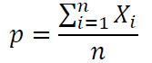

- Vlastnosti relativní četnosti:
  - E(p) = 𝜋; D(p) = 𝜋\*(1 - 𝜋)/n
- Z centrální limitní věty lze odvodit:
  - předpoklad: dostatečná velikost výběru: n > 9/(p\*(1-p))

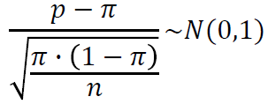

## 6.6 Rozdíl výběrových četností

- Náhodný jev A s pravděpodobností 𝜋1. Náhodný jev B s pravděpodobností 𝜋2.
- Předpokládejme, že provádíme opakovaná nezávislá pozorování těchto jevů
- Potom rozdíl relativních četností obou výběrů má vlastnosti:

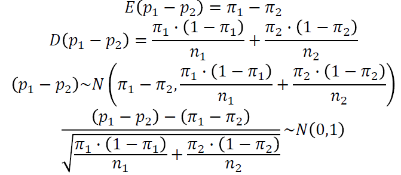

- Předpoklady:
  - Výběry z obou populací jsou dostatečně veké:
    - n1 > 9/(p1(1 - p1))
    - n2 > 9/(p2(1 - p2))
  - Výběry musí být nezávislé

## 6.7 Spojitá rozdělení užívaná ve statistice

### 6.7.1 x2 rozdělení

- Mějme nezávislé náhodné veličiny Zi z nichž každá má normované normální rozdělení. Součet čtverců těchto náhodných veličin - X má rozdělení x2 s n stupni volnosti

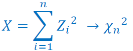

- někdy též Pearsonovo rozdělení
- Veličina s tímto rozdělením může nabývat pouze nezáporných hodnot
- Rozdělení je nesymetrické
- Má paramtr n - počet stupňů volnosti
  - vychází z počtu naměřených dat. Často pro n naměřených dat, porovnáváme s n-1 stupni volnosti
- Využívá se ve statistice při testování veličin
- Základní vlastnosti:
  - Hustota pravděpodobnosti je složitá
  - Střední hodnota rozdělení x2 s n stupni volnosti - E(X) = n
  - Rozptyl rozdělená x2 s n stupni volnosti - D(X) = 2×n
  - Vlivem centrální limitní věty se se vzrůstajícím počtem stupňu volnosti rozdělení x2 s n stupni volnosti blíží normálnímu rozdělení s parametry: N(𝜇 = n, 𝜎2 = 2×n)
- MATLAB:
  - n - počet stupňů volnosti
  - Distribuční finkce - **F=chi2cdf(x,n)**
  - Hustota pravděpodobnosti - **f=chi2pdf(x,n)**
  - Inverze distribuční funkce - **x=chi2inv(pravd,n)**
  - Stanovení střední hodnoty a rozptylů - **[m,v]=chi2stat(n)**
  - Náhodné číslo - **chi2rnd(n)**
- Uplatnění:
  - Odhad rozptylu základního souboru (data musejí být z normálního rozdělení)
  - Testování, zda rozptyl základního rozdšlení je roven 𝜎02
  - Testování nezávislosti proměnných (tzv. kontingenční tabulka)
  - Testování, zda náhodná veličina pochází z určitého rozdělení (zde data musejí být z normálního rozdělení)

### 6.7.2 Studentovo rozdělení

- Dvě nezávislé veličiny Z a V. Z má normované normální rozdělení, V má x2 rozdělení s n stupni volnosti. Potom náhodná veličina T má Studentovo rozdělení s n stupni volnosti

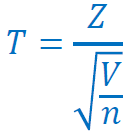

- Studentovo rozdělení značíme tn
- má jediný parametr n - počet stupňů volnosti
- Se zvyšujícím se počtem stupňů volnosti (n > 30) se Studentovo rozdělení blíží normovanému normálnímu rozdělení
- Využívá se při testování veličin
- Vlastnosti:
  - Hustota pravděpodobnosti je složitá
  - Střední hodnota Studentova rozdělení t s n stupni volnosti - E(X) = 0
  - Rozptyl studentova rozdělení t s n stupni volnosti D(X) = n/(n - 2), n > 2
  - Rozdělení je symetrické kolem 0
- MATLAB:
  - n - počet stupň§ volnosti
  - Distribuční finkce - **F=tcdf(x,n)**
  - Hustota pravděpodobnosti - **f=tpdf(x,n)**
  - Inverze distribuční funkce - **x=tinv(pravd,n)**
  - Stanovení střední hodnoty a rozptylů - **[m,v]=tstat(n)**
  - Náhodné číslo - **trnd(n)**
- uplatnění:
  - odhad střední hodnoty výběru, pokud je rozptyl základního souboru neznámý
  - Testování hypotéz o střední hodnotě výběru, pokud je rozptyl výběru neznámý
  - Testování hypotéz o shodě středních hodnot dvou nezávislých výběrů, pokud jsou rozptyly výběru neznámé
  - Regresní analýza
- Data musejí být z normálního rozdělení

### 6.7.3 Fisher Snedecorovo rozdělení

- Dvě nezávislé náhodné veličiny V a W s rozdělením x2. První má m a druhé n stupňů volnosti (obecně odlišné)
- Náhodná veličina F má Fisher-Snedecorovo rozdělení o m, n stupňů volnosti:

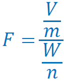

- Fisher-Snedecorovo rozdělení značíme F<aub>m,n
- má dva parametry m a n
- Používá se ve statistice při testování veličin
- Vlastnosti:
  - Střední hodnota - E(X) = n/(n - 2), n > 2
  - Rozptyl:

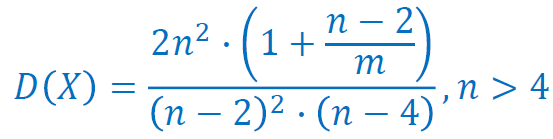

- MATLAB:
  - m,n - počet stupňů volnosti
  - Distribuční finkce - **F=fcdf(x,m,n)**
  - Hustota pravděpodobnosti - **f=fpdf(x,m,n)**
  - Inverze distribuční funkce - **x=finv(pravd,m,n)**
  - Stanovení střední hodnoty a rozptylů - **[m,v]=fstat(m,n)**
  - Náhodné číslo - **frnd(m,n)**
- Uplatnění:
  - Testování shody rozptylů dvou základních souborů
  - Testování shody středních hodnot více než 2 základních souborů (analýza rozptylu)
  - Regresní analýza
- Data musejí být z normálního rozdělení
