# 7. Teorie odhadu

## 7.2 Bodové odhady

- Mějme náhodný výběr z určitého rozdělení, které závisí na parametru Θ. Odhadem T parametru Θ je pak výběrová charakteristika, která nabývá hodnot "blízkýc" k neznámému parametru Θ
- Parametr Θ může být: rozptyl, četnost, medián, střední hodnota, atd.
- Bodový odhad musí splňovat:
  - Nestrannost
    - je-li E(T) = Θ,
    - je-li lim(E(Tn) - Θ)=0;n→∞ => asymptoticky nestranný
  - Konzistentnost
    - je-li lim(P(|Θ - Tn| < ε)) = 1; n→∞
    - Je-li konzistentní, pak je malá pravděpodobnost, že se při zvyšujícím se rozsahu výberu dopustíme velké chyby
  - Vydatnost
    - Taková statistika, která má ze všech nestranných odhadů nejmenší rozptyl
    - limD(Tn) = 0; n→∞
  - Robustnost
    - taková statistika, která není výrazně ovlivnitelná hodnotami způsobené například hrubou chybou
    - není minimum a maximum
    - je aritmetický průměr

## 7.3 Intervalové odhady

- Interval spolehlivosti (konfidenční interval) pro parametr Θ je taková dvojice statistik, pro kterou s pravděpodobností 1-𝛼 (𝛼∈<0,1>) platí:

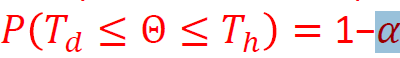

- Spolehlivost odhadu 1-𝛼 požadujeme blízkou 1
  - obvykle 0.05, vzácněji 0.01 nebo 0.001
  - Se snižujícím se 𝛼 se rozšiřuje interval
- Pro zúžení intervalu je třeba mít více naměřených hodnot
  - Pro dvojnásobné zúžení je třeba 4× více dat
- Oboustranný interval spolehlivosti:
  - hledáme interval ve kterém daný parametr leží se spolehlivostí 1-𝛼
  - Výsledek udává obě meze

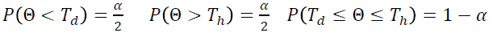

- Jednostranné intervaly spolehlivosti
  - "LEFT"
    - udává pouze horní mez
    - 𝑃(Θ≤𝑇ℎ) = 1−𝛼 interval (−∞,𝑇𝐻),
  - "Right"
    - udává pouze dolní mez
    - 𝑃(Θ≥𝑇𝑑 = 1−𝛼 interval (𝑇𝐷,∞)

## 7.4 Intervalový odhad střední hodnoty normálního rozdělení

- dva případy
  - směrodatná odchylka je předem známá
  - směrodatná odchylka je neznámá
- Nutný předpoklad: Data pocházejí z normálního rozdělení

### 7.4.1 𝜎 je předem známá

- Náhodná veličina je z normálního rozdělení s neznámou střední hodnotou a předem definovanou směrodatnou odchylkou. Vybereme vzorek z populace o rozměru n, který má výběrový průměr

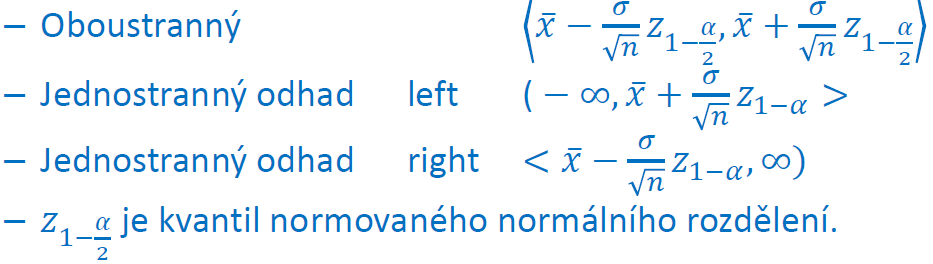

- MATLAB: - **[h,p,ci]=ztest(x,m,sigma,alpha,tail)**
  - h - výsledek hypotézy
  - p - p-value
  - ci - konfidenční interval
  - x - vektor vstupních dat
  - m - střední hodnota se kterou je průměr porovnáván
  - sigma - směrodatná odchylka
  - aplha - hladina významnosti testu
  - tail - typ intervalového odhadu

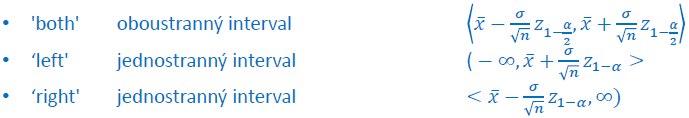

### 7.4.3 𝜎 je neznámá

- náhodná veličina s neznámou střední hodnotou a nedefinovanou směrodatnou odchylkou
- Vybereme vzorek z populace o rozsahu n, který má výběrový průměr a výběrovou směrodatnou odchylku
- Výpočet:

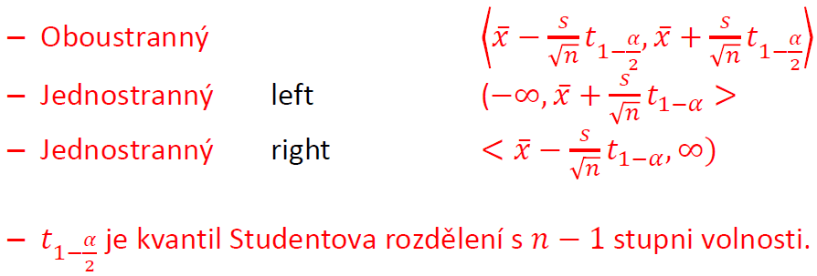

- MATLAB: **[h,p,ci,stats]=ttest(x,m,alpha,tail)**
  - h - výsledek hypotézy
  - p - p-value
  - ci - konfidenční interval
  - stats - výsledek T statistiky, počet stupňů volnosti a směrodatná odchylka
  - x - vektor vstupních dat
  - m - střední hodnota se kterou je průměr porovnáván
  - sigma - směrodatná odchylka (1-alpha)
  - aplha - hladina významnosti testu
  - tail - typ intervalového odhadu
    - 'both' - oboustranný
    - 'left' - jednostranný - - (−∞,𝑇𝐻)
    - 'right' - jednostranný - (𝑇𝐷,∞)

## 7.5 Intervalový odhad rozptylu normálního rozdělení

- Náhodná veličina z normálního rozdělení s neznámou střední hodnotou a neznámým rozptylem
- Vybereme vzorek z populace o rozsahu n, který má výběrový rozptyl

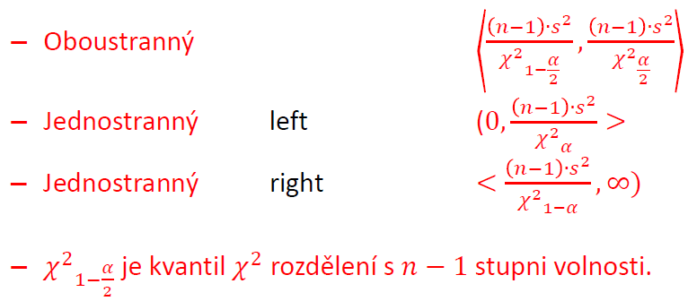

- MATLAB: **[h,p,ci,stat]=vartest(x,v,alpha,tail)**

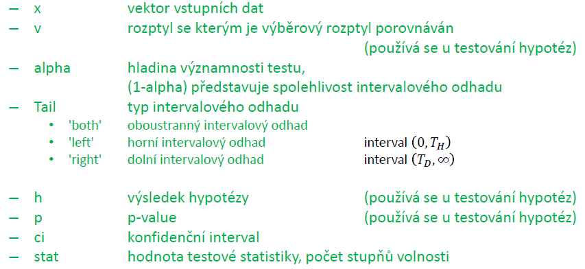

## 7.6 Intervalový odhad směrodatné odchylky normálního rozdělení

- náhodná veličina z normálního rozdělení s neznámou střední hodnotou a neznámým rozptylem
- Vybereme vzorek z populace o rozsahu n, který má výběrovou směrodatnou odchylku s

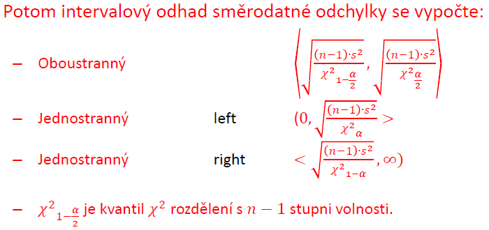

## 7.7 Intervalový odhad relativní četnosti

- výběrový soubor o rozsahu n. Nechť x prvků ze souboru má určitou vlastnost; pravděpodobnost této vlastnosti je p=x/n.
- Dále nechť je rozsah souboru:
  - Dostatečně velký (n > 30)
  - menší než 5% rozsahu základního souboru (n/N < 0.05)
  - Splňující podmínku: n > 9/(p(1-p))

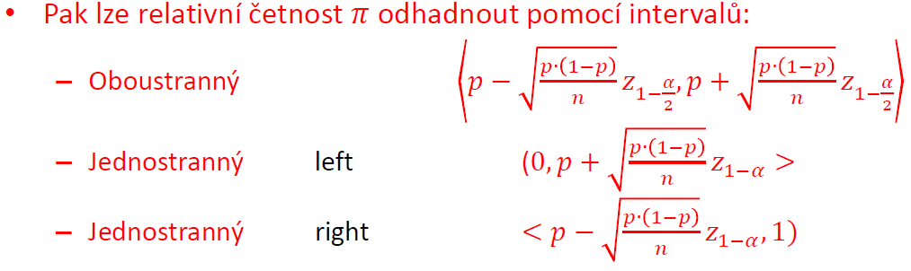

- Není v MATLAB implementován
  - oboustranný: Ci=[p-sqrt(p*(1-p)/n)*norminv(1-alfa/2,0,1),p+sqrt(p*(1-p)/n)*norminv(1-alfa/2,0,1)]
  - jednostranný: Ci=[0, p+sqrt(p*(1-p)/n)*norminv(1-alfa,0,1)]
  - jednostranný: Ci=[p-sqrt(p*(1-p)/n)*norminv(1-alfa,0,1), 1]

## 7.8 Odhad rozsahu výběru

- chceme znát rozsah výběru, jestliže intervalový odhad má mít určitou šířku
- Velikost šířky Δ intervalového odhadu je závislá na velikosti vstupu n
- Odvodíme:
  - Odečtením mezí oboustranného odhadu a vyjádřením n
  - Vzorec pro intervalový odhad střední hodnoty
- Δ je občas definována jako polovina z maximální šířky intervalu
- Odvození:

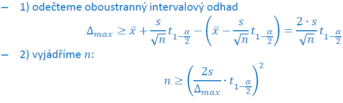

- Výpočet:

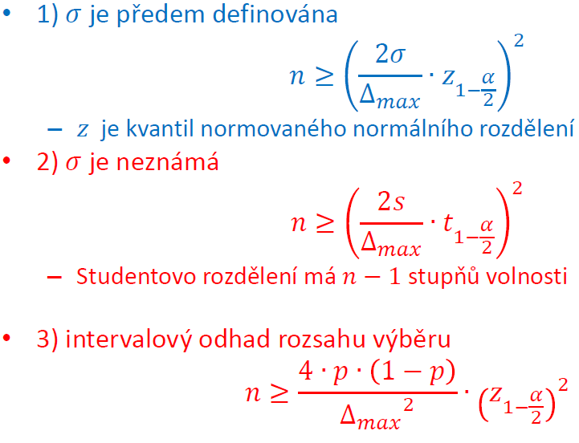

## 7.9 Intervalový odhad mediánu

- Jestliže data nepochází z normálního rozdělení, nelze stanovit intervalový odhad střední hodnoty
- Využívá se například intervalový odhad mediánu s využitím interkvartilového rozpětí
- Intervalový odhad se spolehlivostí 95% se stanoví pomocí vzorce:

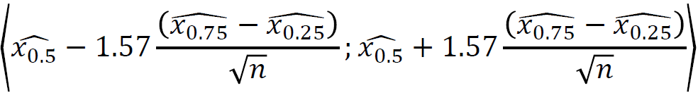

- V MATLABU není implementováno:
  - (median(x)-1.57*iqr(x)/sqrt(n), median(x)+1.57*iqr(x)/sqrt(n))

## 7.10 Intervalový odhad parametrů spojitých rozdělení

- Intervalový odhad lze zjistit i pro náhodnou veličin, která není z normálního rozdělení
- V MATLAB:
  - Diskrétní
    - Binomické rozdělení - **[par,io]=binofit(x,n,aplha)**
    - Poissonovo rozdělení - **[par,io]=poissfit(x,aplha)**
  - Spojité
    - Normální rozdělení - **[par,io]=normfit(x,aplha,cens,freq)**
    - Lognormální rozdělení - **[par,io]=lognfit(x,aplha,cens,freq)**
    - Exponenciální rozdělení - **[par,io]=expfit(x,aplha,cens,freq)**
    - Weibullovo rozdělení - **[par,io]=wblfit(x,aplha,cens,freq)**
    - Gamma rozdělení - **[par,io]=gamfit(x,aplha,cens,freq)**
  - par - odhad hodnoty parametrů
  - io - konfidenční interval parametrů uvedený po sloupcích
  - x - vstupní vektor
  - alpha - hladina váznamnosti (1-alpha)
  - cens - zkouška ukončena, 0 chybou, 1 časem
  - freq - počet výskytů

## 7.11 Intervalový odhad distribuční funkce

- graf empirické distribuční funkce
  - MATLAB: **cdfplot**
- Textové výstupy zajistí **ecdf**
- **[f,x,flo,fup] = ecdf(x,'alpha’,’censoring’,’frequency’)**
  - f - hodnoty skoků distribuční funkce F(x)
  - x - hodnoty změn na x-ové ose
  - flo - dolní mez intervalového odhadu distribuční funkce
  - fup - horní mez intervalového odhadu distribuční funkce
  - alpha - hlavina významnosti
  - censoring - typ ukončení zkoušky (0 porucha, 1 čas)
  - frequency - četnost výsledku

## 7.12 Intervalový odhad poměru rozptylů dvou výběrů s normálním rozdělením

- Mějme 2 výběry z normálního rozdělení
- Vybereme vzorek s populace o rozsahu n1 a n2, který má výběrový rozptyl s12 a s22
- Výpočet intervalového odhadu podílu rozptylů s12/s22:

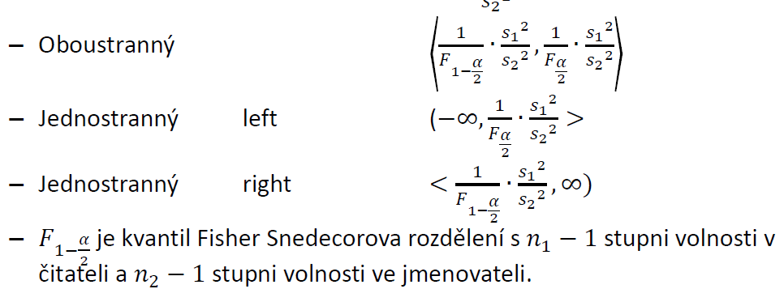

- MATLAB:
  - **[h,p,ci]=vartest2(x,y,alpha,tail)**

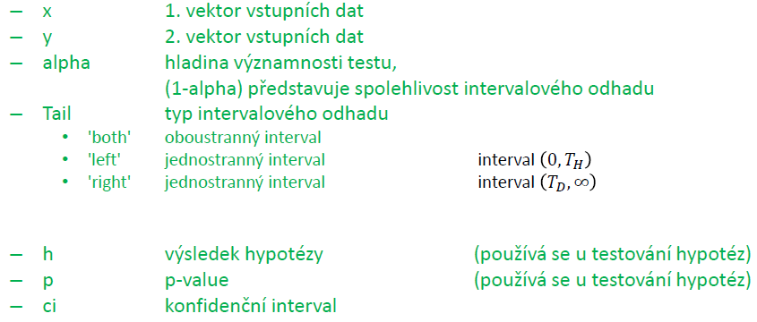

## 7.13 Intervalový odhad rozdílu středních hodnot dvou výběrů s normálním rozdělením

- Výpočtu musí předcháze test shody rozptylů dvou výběrů kapitola 8.4.1 (nebo 7.11)
- Známe rozptyly (jsou předem definované)
  - Není v MATLAB implementován

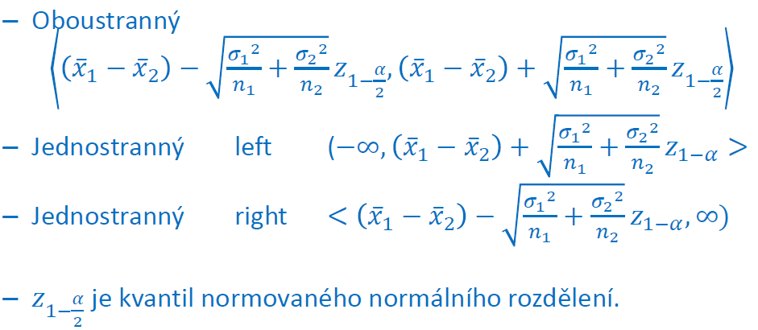

- Neznáme rozptyly obou populací, ale lze předpokládat, že jsou shodné
  - Shodnost rozptylu dvou výběrů lze ověřit statistickým testem, který obvykle předchází výpočtu intervalového odhadu

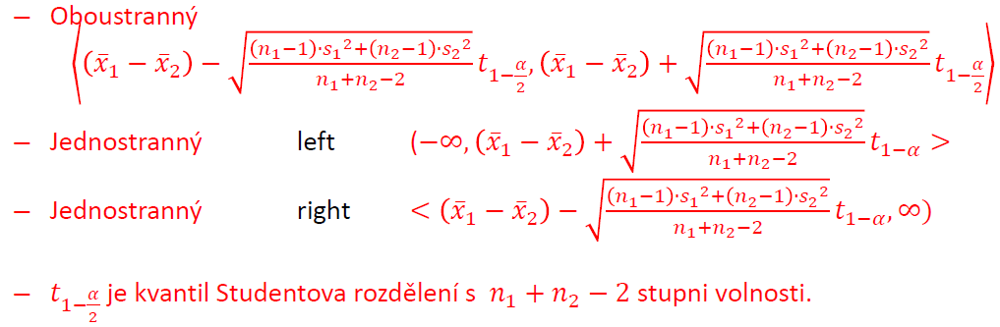

- Neznáme rozptyly obou populací a lze předpokládat, že nejsou shodné
  - (Ne)shodnost rozptylu dvou výběrů lze ověřit statistickým testem, který obvykle předchází výpočtu intervalového odhadu.

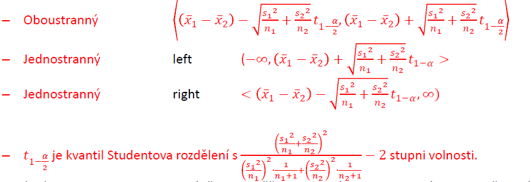

- MATLAB: **[h,p,ci]=ttest2(x,y,alpha,tail,vartype)**

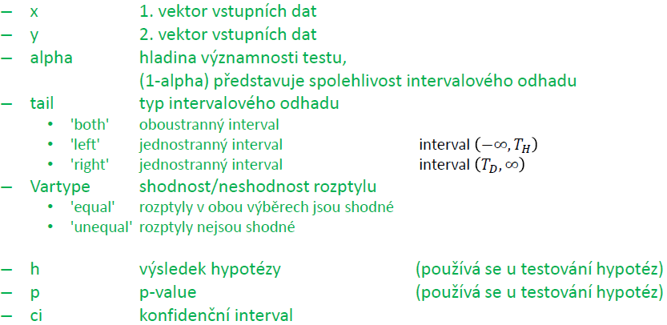

## 7.14 Intervalový odhad pro rozdíl relativních četností dvou populací

- Mějme 2 populace, z nichž byly provedeny dva nezávislé náhodné výběry o rozsahu n1 a n2, kde počet prvků s určitou vlastností je x1 a c2.
- Potom pravděpodobnost výskytu určité vlastnosti je p1 = x1/n1 a p2 = x2/n2
- Nnechť dále platí o rozsahu výběru:
  - Výběry jsou dostatečně velké => n1 > 30, n2 > 30
  - Máme méně než 5% rozsahu základního souboru => n1/N1 < 0.05, n2/N2 < 0.05
  - Splňuje podmínky: n1 > 9/(p1(1 - p1)) a n2 > 9/(p2(1 - p2))
- Nechť dále platí :
  - p = (x1 + x2)/(n1 + n2)
- Potom intervalový odhad:

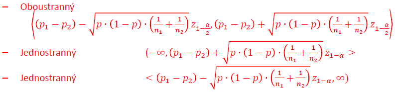

- Není implementovám v MATLAB, proto vzorce:
  - vstup:
    - n1,n2,x1,x2,alfa
    - p1 = x1/n1
    - p2 = x2/n2
    - p = (x1+x2)/(n1+n2)
  - Oboustranný intervalový odhad
    - Ci=[(p1-p2)-sqrt(p*(1-p)*(1/n1+1/n2))*norminv((1-alfa/2),0,1),(p1-p2)+sqrt(p*(1-p)*(1/n1+1/n2))*norminv((1-alfa/2),0,1)]
  - Jednostranný <-∞,Ci>
    - Ci=((p1-p2)+sqrt(p*(1-p)*(1/n1+1/n2))\*norminv((1-alfa),0,1))
  - Jednostranný <Ci,∞>
    - Ci=((p1-p2)-sqrt(p*(1-p)*(1/n1+1/n2))\*norminv((1-alfa/2),0,1))
