# 8. Testy Hypotéz

## 8.1 Princip testování hypotéz

- Pomocí statistického usuzování rozhodujeme na základě informací získaných z náhodných výběrů, zda přijmeme, nebo zamítneme určitou hypotézu týkající se základního souboru
- statistická hypotéza -může se týkat:
  - neznámých parametrůvýběru
  - typu rozdělení
  - nezávistosti dat a dalších vlastností základního souboru
  - proložení spojitých dat
- Parametrická hypotéza - pojednává o parametrech rozdělení náhodné veličiny
- Neparametrická hypotéza - nepojednává o parametrech rozdělení náhodné veličiny
- Rozdělení podle počtu výběrů
  - Jednovýběrové
  - Dvouvýběrové
  - Vícevýběrové
- 2 drugy hypotéz
  - Nulová hypotéza H0
    - sledovaný efekt je nulový a bývá vyjádřena rovností mezi testovaným parametrem a jeho očekávanou hodnotou
  - Alternativní hypotéza
    - popírá tvrzení dané hypotézou H0
- Možnosti tvrzení hypotéz:
  - Nulová hypotéza, musí vždy obsahovat rovnost
    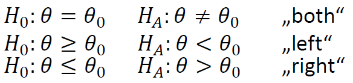
- Nulovou hypotézu považujeme za pravdivou, až do okamžiku, kdy nás výsledky potvrdí o opaku.
  - Zamítáme hypotézu H0 ve prospěch hypotézy HA
  - Nezamítáme H0
- Chyba 1. druhu
  - H0 je platná a my ji zamítáme
  - Tuto pravděpodobnost nazýváme hladinu významnosti 𝛼
- Spolehlivost testu
  - H0 je platná a není zamítnuta
  - tato pravděpodobnost je 1 - 𝛼
- Síla testu
  - H0 není platná a je zamítnuta
  - Vzniká s pravděpodobností 1-𝛽
- Chyba 2. řádu
  - H0 není platná ale je přijata
  - Vzniká s pravděpodobností 𝛽

## 8.2 Přístup k testování hypotéz

- Postup
  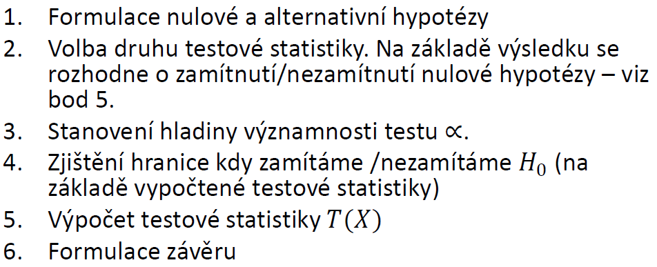
- Postup testu významnosti
  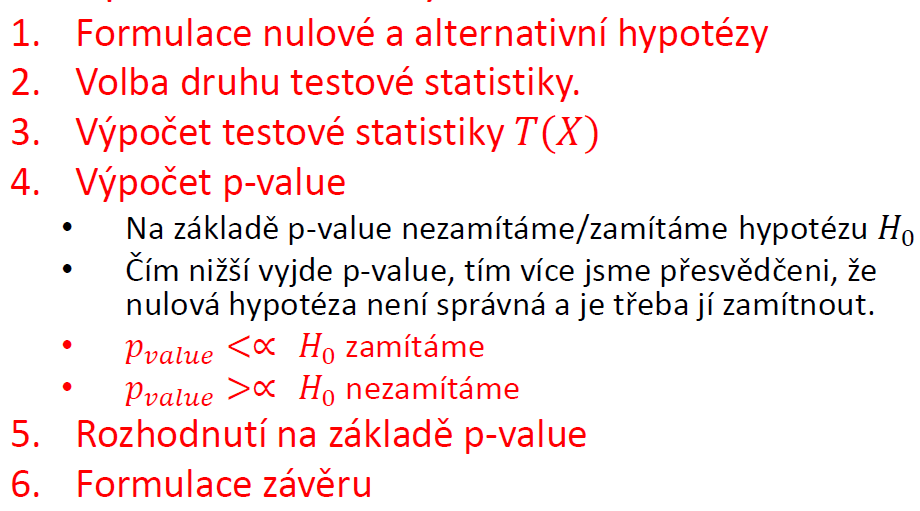
- Co p-value a jak ji počítat?
  - Čím nižší je p-value, tím více jsme přesvědčeni, že nulová hypotéza není správná a je třeba ji zamítnout

## 8.3 Jednovýběrové testy

### 8.3.1 Test rozptylu normálního rozdělení

- Na základě výběru chceme ověřit předpoklad, že rozptyl populace 𝜎<sup>2</sup> se rovná hodnotě výběrového rozptylu z naměřených dat s<sup>2</sup>
- Testovací kritérium: T(X) = s<sup>2</sup>/𝜎<sup>2</sup>×(n-1)
  - Testovací kritérium má x<sup>2</sup> rozdělení s (n-1) stupni volnosti
- Seznam hypotéz:
  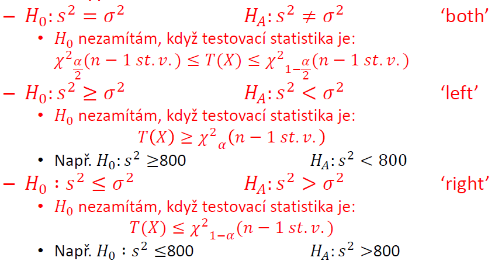
- MATLAB: **[h,p,ci,stats]=vartest(x,v,alpha,tail)**
  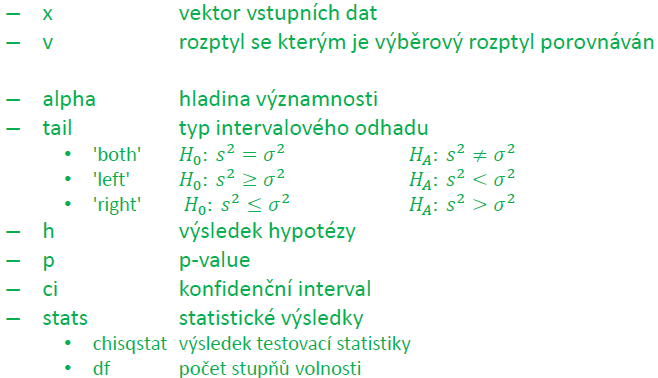

### 8.3.2 Test Střední hodnoty normálního rozdělení

- Na základě výběru chceme ověřit předpoklad, že střední hodnotapopulace se rovná naměřeným hodnotám
- Testovací kritérium:
  - Rozptyl je předem definovaný, testovací kritérium má normální rozdělení
    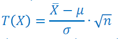
  - Rozptyl není definovaný, testovací kritérium má Studentovo t rozdělení s n - 1 stupni volnosti
- Seznam hypotéz
  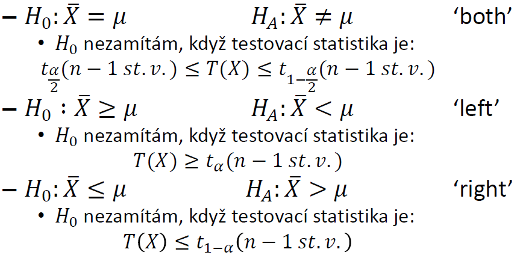
- MATLAB:
  - Rozptyl předem definovaný: **[h,p,ci,stats]=ztest(x,m,sigma,alpha,tail)**
  - Rozptyl není předem definovaný: **[h,p,ci,stats]=ttest(x,m,alpha,tail)**
    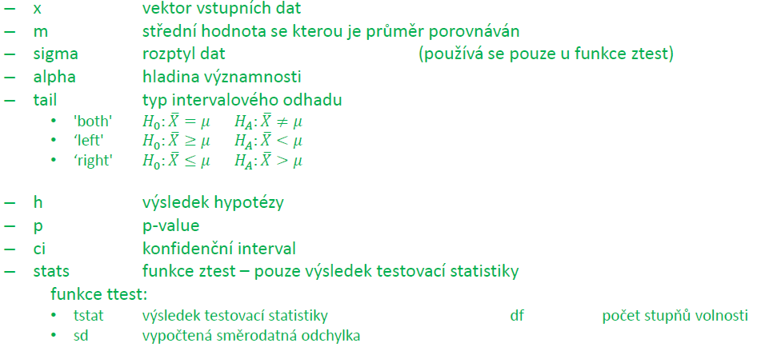

### 8.3.3 Párový test

- mějme populaci z normálního rozdělení s neznámou střední hodnotou uskutečněnou před a střední hodnotou uskutečněnou po určité operaci
- na zíkladě výběru chceme ověřit předpoklad, že střední hodnota populací je shodná
  - Rozdíl dvou normálních rozdělení je opět normální rozdělení
  - Rozdílem výsledků po apřed danou operací obdržíme změnu. Testujeme, zda vliv této změny je nulový či nikoliv
- Testování probíha pomocí funkce ttest, kde vstupem jsou rozdíli po a před měřením.
- Je možné provádět i jednostranné testy, nebo s posunem definováním parametru m

### 8.3.4 Znaménkový test

- umožňuje na základě výběru ověřit předpoklad, že se medián náhodného výběru rovná testované hodnotě
- Testovací kritéria:
  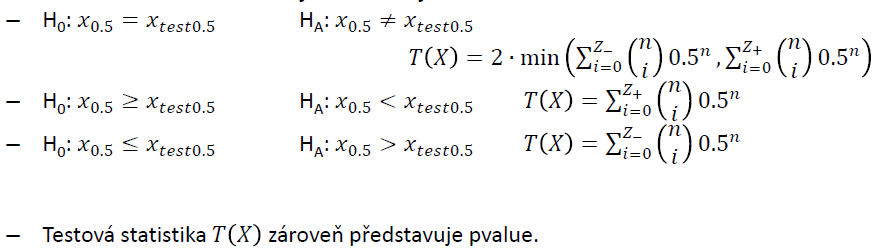
- neparametrický test, protože není nutný předpoklad o tvaru rozdělení
- Jestliže se některé z hodnot rovnají testovacému mediánu, budou vynechány
- MATLAB: **[p,h]=signtest(x,m,alfa,’tail’,’both’)**
  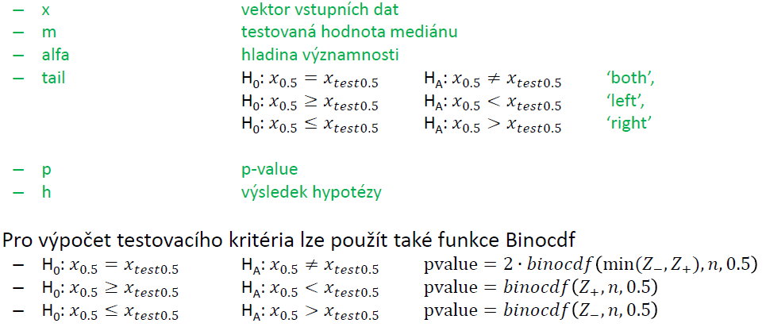

### 8.3.5 Znaménkový test - párový

- Kombinuje párový a znaménkový test
  - populace s neznámým mediánem uskutečněným před a mediánem uskutečněném po určité operaci, Na základě výběru chceme ověřit, že jsou shodné
  - ověřit předpoklad, že rozdíl mediánů náhodného výberu se rovná 0 nebo konstantě
- MATLAB: **[p,h]=signtest(x,y,alfa,’tail’,’both’)** - y je vektor

### 8.3.6 Wilccoxonův test

- umžňuje na základě výběru ze spojitého rozdělení s hustotou f(x), která je symetrická kolem mediánu, zda se rovná testované hodnotě mediánu
- Postup:
  - Pro každou naměřenou hodnotu z výběru určíme Y<sub>i</sub> = X<sub>i</sib> - x<sub>test0.5</sub>
  - Seřaďme Y<sub>i</sub> vzestupně podle absolutní hodnoty a zaznamenejme jejich původní znaménko
  - Učeme pořadí veličiny |𝑅<sub>𝑖</sub>|=|𝑌<sub>1</sub>|≤ |𝑌<sub>2</sub>|≤⋯≤|𝑌<sub>𝑛</sub>|. v případě shodných hodnot průměrujte pořadí
  - Označte R<sub>i</sub><sup>+</sup> pořadí veličin s kladným znaménkem a R<sub>i</sub><sup>-</sup> se záporným
  - testová statistika je:
    
    a je nutno následně hledat v tabulkách
- Pro stanovení zamítnutí/nezamítnutí hypotézy H0 lze pro větší množství naměření dat převést výsledek na normované normální rozdělí pomocí vzorce:


- z tohoto lze pomocí normcdf stanovit podle hypotézy p-value:
  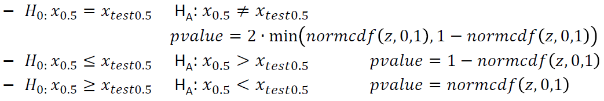
- jedná se o neparametrický test, protože není nutný předpoklad o tvaru rozdělení
- Jestliže se některé hodnoty rovnají testovanému mediánu, budou vynechána
- MATLAB: **[p,h,stats]=signrank(x,m,alpha,method,tail)**

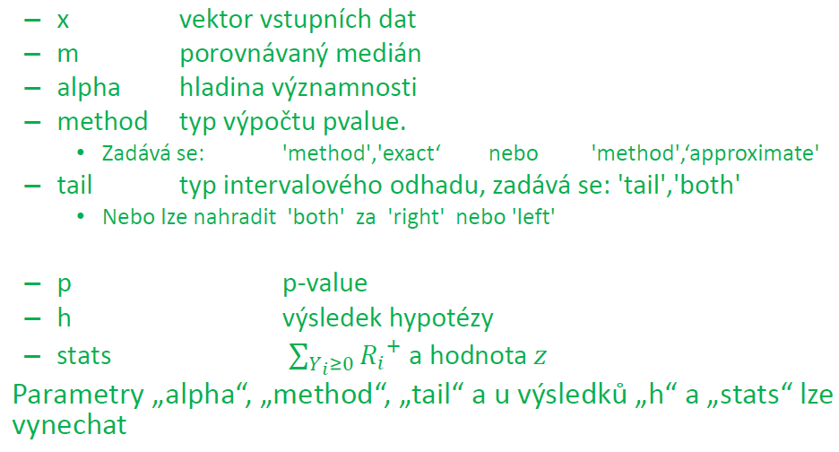

- obdobně jako u znaménkového testu je Wilcoxonův test - párový

### 8.3.7 Test o prarametru 𝜋 relativní četnosti

- v sérii n nezávislých pokusů se jev A, vyskytl K krát
- Pravděpodobnost náhodného jevu je p=k/n a chceme ověřit, zda teoretická pravděpodobnost se rovná p
- Pro provedení tesu je nutné mít alespoň n > 9/(p×(1-p)) pokusů
- testovací statistika je:

```
          p - 𝜋
T(X) = ------------ × √n
        √(𝜋×(1-𝜋))
```

- Testovací kritérium má normované normální rozdělení
- Seznam hypotéz:
  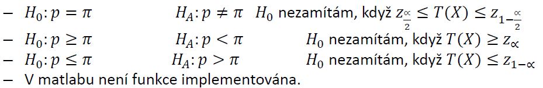
- MATLAB:
  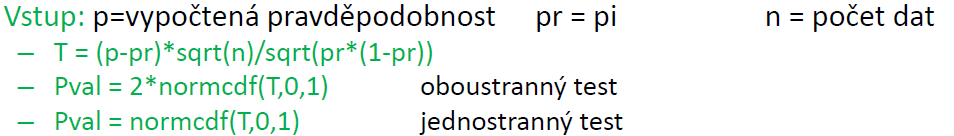

### 8.3.8 Testy hodnot parametrů nenormálních rozdělení

## 8.4 Dvouvýběrové testy

### 8.4.1 Test o shodě dvou rozptylů, výběrů z normálního rozdělení

- chceme otestovat zda 𝜎<sub>x</sub><sup>2</sup> = 𝜎<sub>y</sub><sup>2</sup>
- Vypočteme výběrový rozptyl z obou výběrů
- Potom testovací kritérium je: T(X,Y) = s<sub>x</sub><sup>2</sup>/s<sub>y</sub><sup>2</sup>
- Testovací kritérium má F rozdělení s n<sub>x</sub>-1, n<sub>y</sub> -1 stupni volnosti
- Seznam hypotéz:
  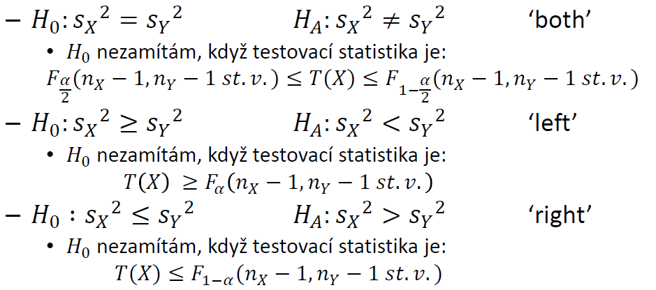
- MATLAB: **[h,p,ci,stats]=vartest2(x,y,alpha,tail)**

### 8.4.2 Test o shodě dvou středních hodnot, výběrů z normálního rozdělení

- Chceme otestovat, zda 𝜇<sub>x</sub> = 𝜇<sub>y</sub>.
- Mohou nastat následující případy:
  - Předem jsou definované rozptyly obou populací
    - velmi vzácné
    - Testovací kritérium: 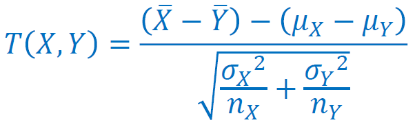
    - Testovací kritérium má normované normální rozdělení
    - Není v MATLAB implementováno
  - Rozptyly populací nejsou známy, ale předpokládáme, že jsou shodné
    - Testovací kritérium: 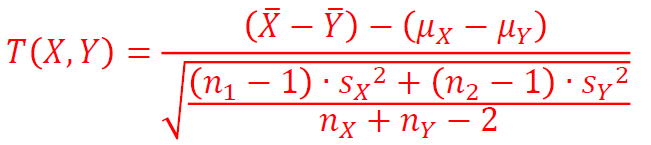
    - Testovací kritérium má Studentovo rozdělení s n<sub>x</sub> + n<sub>x</sub> -2 stupni volnosti
  - Rozptyly nejsou známy, ale předpokládáme, že nejsou shodné
    - Testovací kritérium: 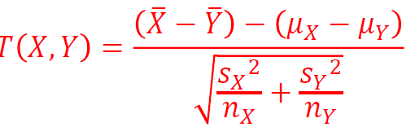
    - Má studentovo rozdělení s 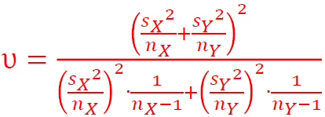 stupni volnosti
    - MATLAB: **[h,p,ci,stats]=ttest2(x,y,alpha,tail,vartype)**
  - Párové testy jsou uvedeny v kapitole 8.3.3
- Předchází mu test shody rozptylů
- Je nutno ověřit, že data pochází z normálního rozdělení

### 8.4.3 Mann-Whitneyův test mediánů

- neparametrický test o shodě mediánů
- dva nezávislé výběry se stejným rozptylem a tvarem rozdělení
- Hypotézy:

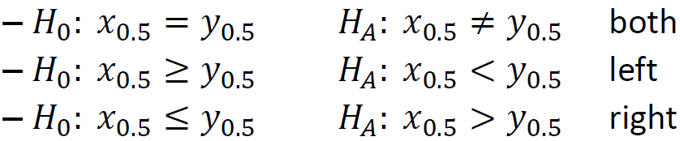

- MATLAB: **[p,h,stats]=ranksum(x,y,alpha,method,tail)**

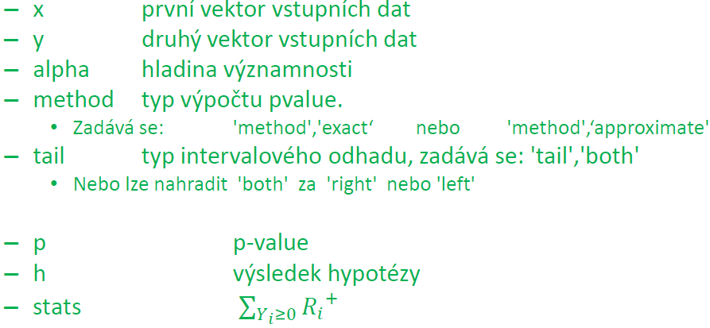

### 8.4.4 Testování relativních četností

- v sérii n1 nezávislých opakování se náhodný jev A vyskytl x-krát. V sérii n2 se vyskytl náhodný jev A y-krát
- pravděpodobnost výskytu jevu A: p<sub>1</sub> = x/n1; p<sub>2</sub>= x/n2
- Předpoklad testu je že: n1 > 9/(p<sub>1</sub>×(1-p<sub>1</sub>)) a n2 > 9/(p<sub>2</sub>×(1-p<sub>2</sub>))
- Hypotézy:

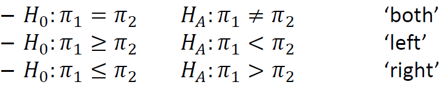

- MATLAB: - není implementováno
  - T=(p1-p2)/sqrt((p1*(1-p1)/n1)+(p2*(1-p2)/n2))

## 8.5 Vícevýběrové testy

### 8.5.1 Test shody rozptylů

- máme k nezávislých výběrů z normálního rozdělení a chceme testovat hypotézu:
  - H0: 𝜎<sub>1</sub><sup>2</sup>=𝜎<sub>2</sub><sup>2</sup>=⋯=𝜎<sub>k</sub><sup>2</sup>
  - HA: alespoň jedna dvojice rozptylů se liší
- Využíváme:
  - Bartlettův test (nutná normalita vstupních dat)
    - testovací kritérium popisuje x<sup>2</sup> rozdělení
  - Levenův test (méně citlivý na porušení normality)
    - testovací kritérium popisuje F rozdělení
  - Výsledke:
    - p-value a statistické údaje
    - Tabulka - výsledky testové statistiky, stupně volnosti, p-value
    - krabicový graf s naměřenými daty
- MATLAB: **[p,stats]=vartestn(X,group,’display’,’testtype’)**

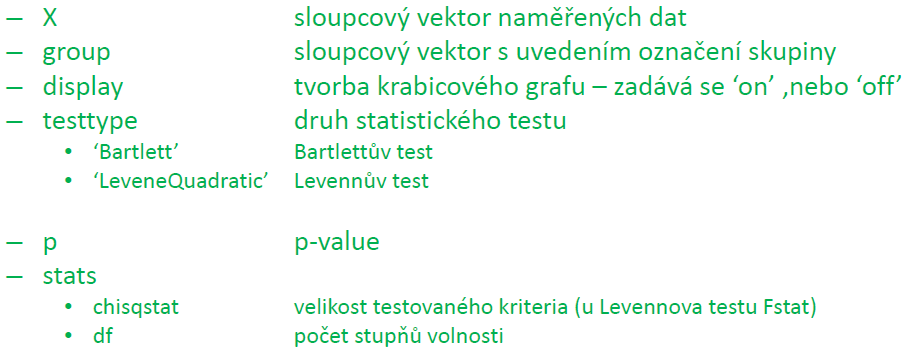

### 8.5.2 Jednofaktorová ANOVA

- anova - analýza rozptylu
- používá se pro porovnání shody průměrů více než dvou výběrů
- předpoklady:
  - nezávislost výběrů
  - Normalita rozdělení všech výběrů
  - Shodné rozptyly všech výběrů
  - Pokud není splněno - použít Kruskal-Wallisův test
- Testujeme:
  - Máme k(k>2) nezávislých výběrů
  - H0: 𝜇<sub>1</sub>=𝜇<sub>2</sub>=⋯=𝜇<sub>𝑘</sub>
  - HA: Alespoň dvě střední hodnoty nejsou rovny
- MATLAB: **[p,anovatab,stats]=anova1(X,group,displayopt)**

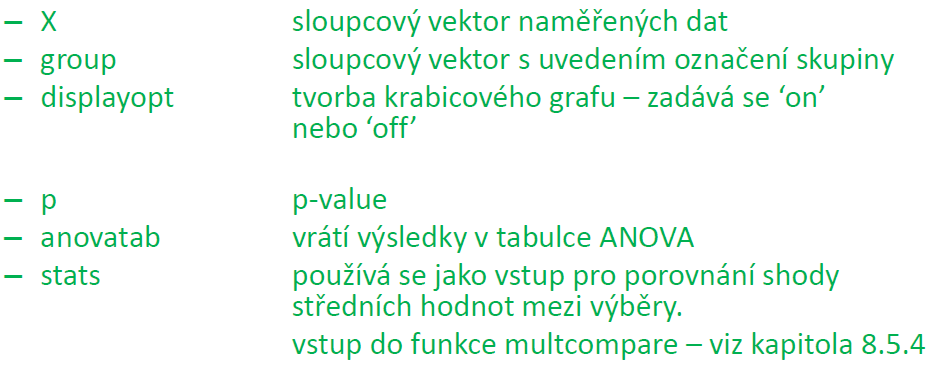

### 8.5.3 Kruskal-Wallisův test

- neparametrická odboba metody ANOVA
- je odbodou Mannova-Whitneyova testu pro více než 2 výběry
- 𝐻0: 𝑥<sub>0.51</sub>=𝑥<sub>0.52</sub>=⋯=𝑥<sub>0.5𝑘</sub>
- HA: alespoň jedna shoda mediánů neplatí
- MATLAB: **[p,anovatab,stats]=kruskalwallis(X,group,displayopt)**

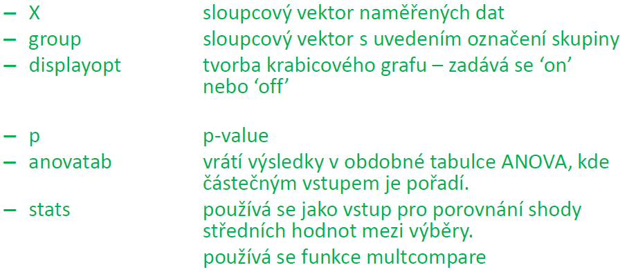

### 8.5.4 Metody mnohonásobného porovnávání

- Vpřípadě zam,ítnutí hypotézy shody všech středních hodnot (mediánů) je třeab zjistit mezi kterými výběry dochází k rozdílům
- Testuje se:
  - 𝐻0: 𝜇<sub>𝐼</sub>=𝜇<sub>𝐽</sub>, 𝐻𝐴: 𝜇<sub>𝐼</sub>≠𝜇<sub>𝐽</sub> pro každou kombinaci výběrů
  - obdobně pro shodu mediánů
- Existuje několik metod:
  - Tekeyova metoda
  - Bonferroniho metoda
  - Scheffeho metoda
- MATLAB: **[comparison,means]=multcompare(stats,’parametr1’,…)**


### 8.5.5 Dvoufaktorová vývážená ANOVA

- Dvoufaktorová anova pro porovnání shody průměrů rozdělených podle dvou faktorů, kde každý faktor má více než dva výběry
- Vyvážená - v každé buňce tabulky stejný počet měření, i tak lze použít nevyváženou anovu
- MATLAB: **anova2**

### 8.5.6 Dvoufaktorová nevyvážená ANOVA

- Dvoufaktorová anova pro porovnání shody průměrů rozdělených podle dvou faktorů, kde každý faktor má více než dva výběry
- Nevyvážená - v každé buňce tabulky stejný počet měření
- MATLAB: **[p,table,stats]=anovan(y,group,param)**


### 8.5.7 Vícefaktorová ANOVA

- Shodný způsob výpočtu s dvoufaktorovou nevyváženou anovou
- Vstupují více než 2 faktory
- Oři výpočtu se výrazně zvyšuje počet vzájemných interakcí, proto při menším počtu dat se využívá lineární model
- MATLAB: **[p,table,stats]=anovan(y,group,param)**


### 8.5.8 Friedmanův test

- obdoba vícefaktorové anovy, jesltiže data nejsou z normálního rozdělení
- jedná se o vyváženou anovu, to unamená, že v každé buňce musí být stejný počet vstupních dat
- MATLAB: **[P,TABLE,STATS] =friedman(X,REPS,DISPLAYOPT)**
  - Vstupy obdobné jako u dvoufaktorové vyvážené anovy

### 8.5.9 Další Testy

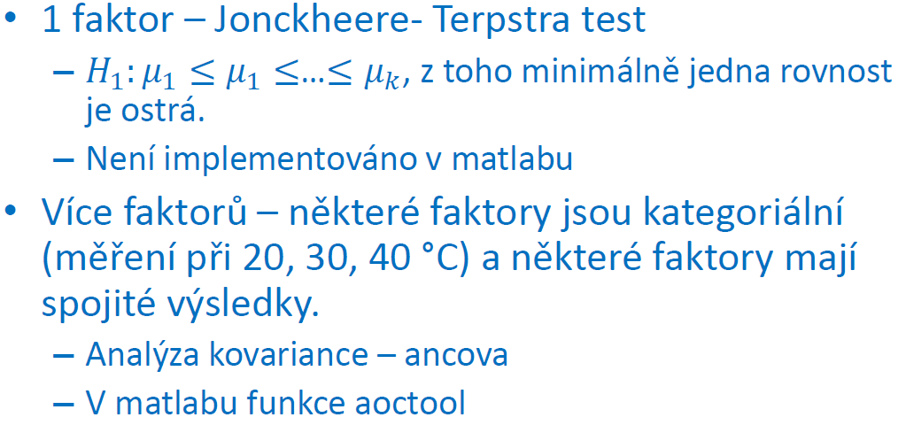

## Přehled testů

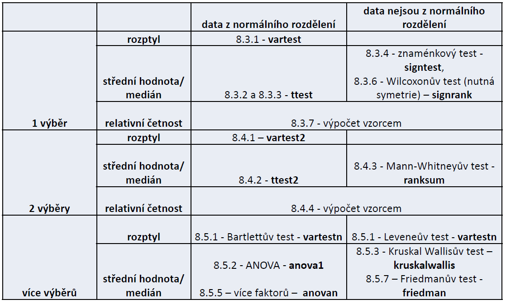
