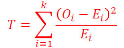
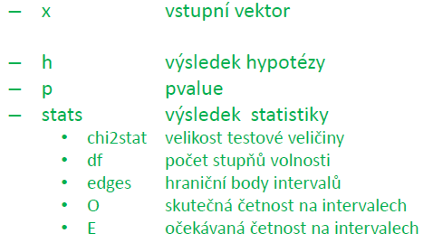
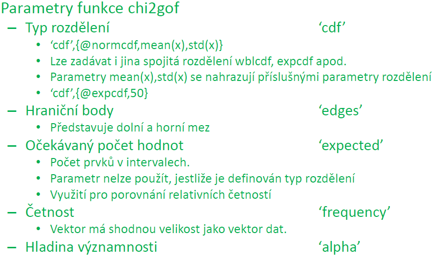
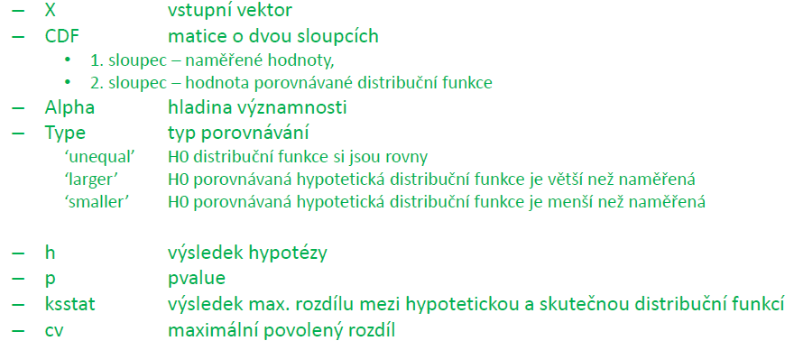
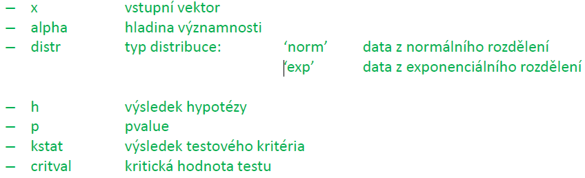
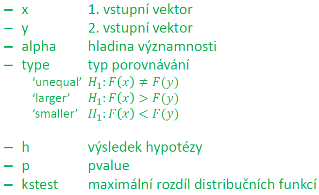

# 9. Testy dobré shody

- využíváme - testy dobré shody
  - H0: Teoretické a empirické rozdělení se shoduje
  - HA: Teoretické a empirické rozdělení se neshoduje
- Nejčastěji se používá:
  - x2-test dobré shody
    - ověření shody distribucí na základě rozdílů mezi skutečností Oi a očekávanou Ei
  - Kolmogorov-Smirnovův test
    - maximální rozdíl distribuce mezi očekávanou a zjištěnou distribuční funkcí

## 9.1 X2 - test dobré shody

- Test je založen na porovnávání očekávané četnosti Ei = n×𝜋i a naměřené četnosti Oi
- Testovací kritérium

- Testovací kritérium, jestliže se provádí dostatečně velký výběr, má přibližně x2 rozdělení s k-1 stupni volnosti
  - V každé skupině musí být očekávaná četnost větší než 5
- x2</yup> - test dobré shody lze použít pro ověření, zda data pocházejí z určitého typu rozdělení
- Testuje se hypotéza:
  - H0: data pocházejí z daného rozdělení
  - HA: data nepocházejí z daného rozdělení
- K otestování se používají funkce **....fit**, kde první část je typ rozdělení (binofit, expfit,...)
- MATLAB: **[h,p,stats]=chi2gof(x,’parametr1’,hodnota,…)**

- nutno dávat pozor, zda se intervaly výrazně neslučují. Může ovlivnit kvalitu výsledků.
- V případě malého počtu stupňů volnosti, je vhodné použít Kolmogorov-Sminovův test

## 9.2 Kolmogorov-Smirnovův jednovýběrový test rozdělení
- k ověření hypotézy, zda výběr pochází z rozdělení se spojitou distribuční funkcí
- MATLAB: **[h,p,ksstat,cv]=kstest(x,CDF,alpha,type)**

- funkce kstest se využívá především pro porovnání s distribuční funkcí, kterou předem známe
- není-li předem známa použijeme "lillietes"
- LILLIETEST
  - pro ověření zda data pochází z normálního nebo exponenciálního rozdělení s libovolnými parametry
  - MATLAB: **[h,p,kstat,critval]=lillietest(x,alpha,distr)**

## 9.2 Kolmogorov-Smirnovův dvouvýběrový test rozdělení
- k ověření hypotézy, dza dva výběry pochází z rozdělení se shodnou distribuční funkcí
  - H0: F(x) = F(y)
  - HA: F(x) != F(y)
- MATLAB: **[h,p,kstest]=kstest2(x,y,alpha,type)**

