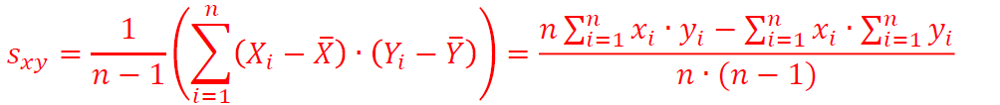
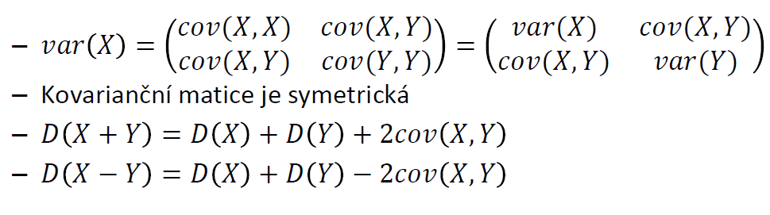
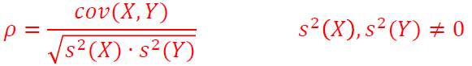
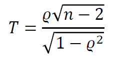
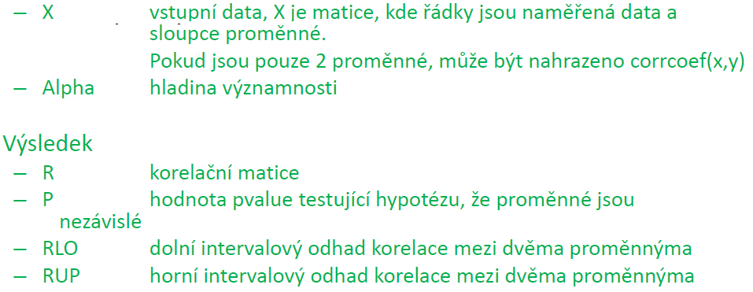
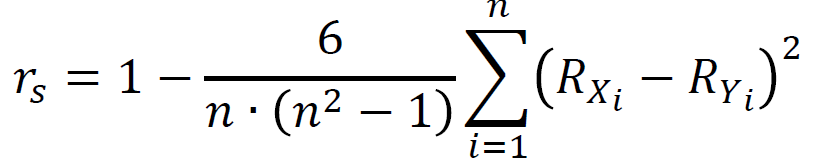
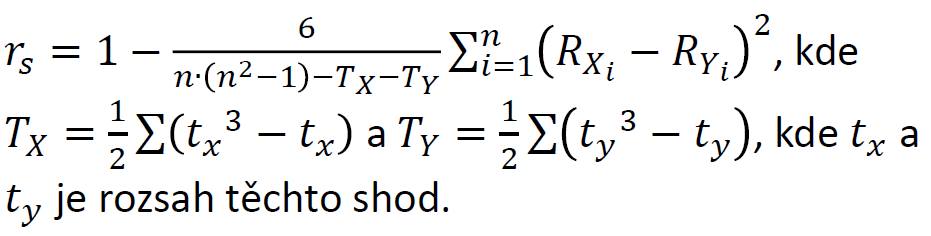
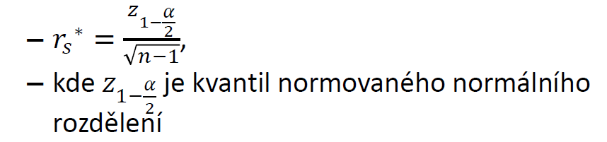
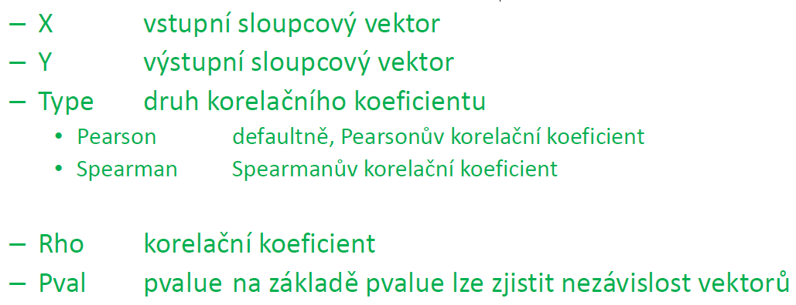

# 10. Analýza závislostí

- pro stanovení, zda naměřené hodnoty dvou výběrů jsou vzájemně nezávislé
- Mějme znaky X a Y, které nabývají určitých hodnot
  - X a Y diskrétní hodnoty - Kontingenční tabulky
  - X a Y spojité odnoty - Pearsonův a Spearmanův korelační koeficient

## 10.1 Kontingenční tabulky

- k vizualizaci vzájemného vztahu dvou statistických znaků
- Řádky tabulky odpovídají možným hodnotám prvního znaku
- Sloupce odpovídají možným hodnotám druhého znaku
- V příslušné buňce je uveden počet případů nij, kdy nastala i-tá hodnota prvního a j-tá hodnota druhého znaku
- Chceme určit zda znaky uvedené vtabulce jsou nezávislé
  - Testování vychází z obdobného principu jako u dobré shody
- MATLAB: **[tbl,chi2,p]=crosstab(x1,x2)**
  - X1 - vektor hodnot prvního dnaku
  - X2 - vektor hodnot 2. znaku
  - tbl - kontingenční tabulka
  - chi2 hodnota

## 10.2 Kovariance

- lze stanovit míru lineární závislosti dvou náhodných veličin
- jedná se o smýšený rozptyl dvou vektorů
- funkce:

- MATLAB: **cov(x,y)**
- Hodnota kovariance může být:
  - cov(x,x) > 0 - obě veličiny rostou, případně klesají, což může naznačovat lineární závislost
  - cov(x,y) < 0 - jedna veličina roste a druhá klesá, což může naznačovat lineární závislost
  - cov(x,y) ≅ 0 - veličiny se neovlivňují, což může znamenat lineární nezávislost
- Kovarianční matice:

## 10.3 Pearsonův koeficient korelace

- používá se, jestliže vstupní data mohou nabývatspojitých hodnot, a zároveň jsou normálně rozděleny
- Výpočet se stanoví z výběrové kovariance a výběrových rozptylů. Výhodou je že rorelační koeficient je omezen mezi -1 a 1:

- Testování lineární ne/závislosti dat
  - H0: 𝜌=0
  - 𝐻𝐴: 𝜌≠0
- Testovací kritérium:
  - Má Studentovo rozdělení s n-2 stupni volnosti
  - Rozhodnutí o výsledku se provede na základě p-value

- Předpoklad: Vstupní data obou vektorů musí být normálně rozdělená
- MATLAB: **[R,P,RLO,RUP]=corrcoef(X,’alpha’)**

## 10.4 Spearmanův koeficient korelace

- používá se, jestliže vstupní data mohou nabývat spojitých hodnot, a není splněn předpoklad o jejich normálním rozdělení

- Při shodném pořadí nabývá koeficient rs maximální hodnoty 1; při zcela opačném minimální hodnoty -1
- Je-li hodnota Spearmanova koeficientu rs = 0 pořadí veličin jsou náhodně zpřeházena
- Korekce:
  - Je-li velké množství hodnot shodných
  - Výpočet:

- Testuje se hypotéza:
  - H0. X a Y jsou nezávislé náhodné veličiny
  - HA: X a Y jsou závislé náhodné veličiny
- Testování ne/závislosti se určuje pomocí kritéria:

- Hypotézu H0 zamítáme, jestliže |rs|≥rs\*
- MATLAB: **[rho,pval]=corr(x,y,'type','Spearman')**

