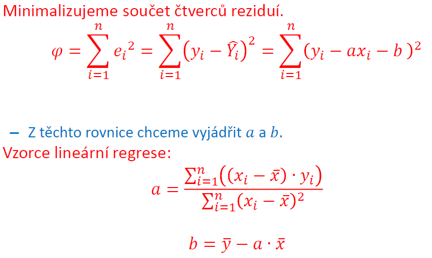
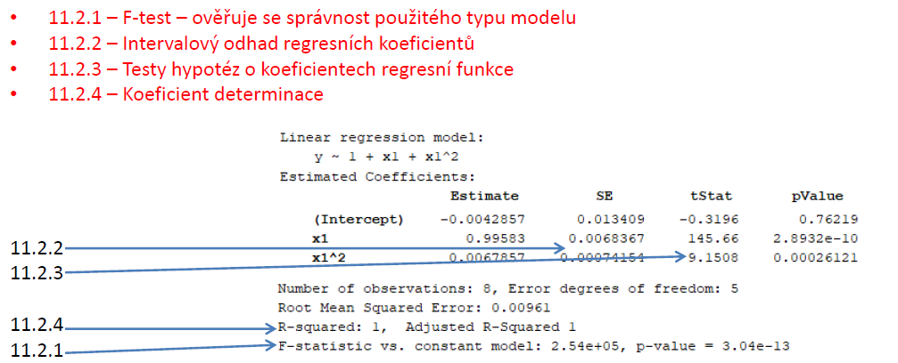
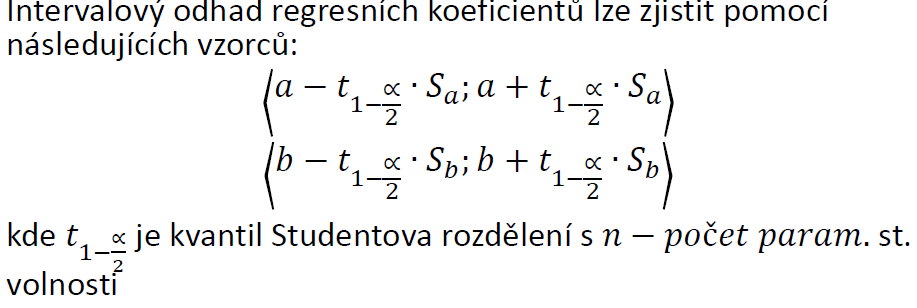
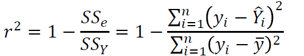

# 11 Regresní analýza

- regrese umožňuje odhadovat hodnotu jisté spojité náhodné veličiny na základě znalosti jiných nezávislých veličin
- Regresní analýza hledá funkční závislost mezi vysvětlující a vysvětlovanou

## 11.1 Leneární regrese

### 11.1.1 Úvod do lineární regrese

- Naměřené hodnoty y jsou zatíženy chybou, snaha o proložení určitou funkční závislostí, která by minimalizovala součet kvadrátů chyby
- Někdy nazývaná metoda nejmenších čtverců
- Vstupem
  - n - počet naměřených dat
  - [xi,yi] - naměřené hodnoty
- Lineární regrese = Y = ax + b
  - a,b, - regresní koeficienty
  - x - nezávislá proměnná, vysvětlující proměnná, regresor
  - y - závislá proměnná, vysvětlovaná proměnná, regresand

### 11.1.2 Lineární regrese

- Lineární rtegresní model
  - Matematická analýza: y = ax + b
  - Statistika: yi + axi + b + 𝜀i
  - 𝜀i je náhodná složka i-tého měření
- Hledáme a a b tak, abychom minimalizovali sumu kvadrátů náhodných složek

- Předpoklady:
  - náhodné chyby mají normální rozdělení
  - střední hodnota je nulová
  - rozptyl náhodné složhy je konstantní
  - navržený modle nesmí být lineárně závislý

- MATLAB: **NLM=fitlm(x,y,modelfun,další parametry)**

## 11.2 Verifikace modelu

### 11.2.1 Ftest

- ověřuje se správnost použitého modelu
  - H0: všechny parametry = 0 (kromě konstantního parametru)
  - HA: některý z parametrů != 0
  - obvykle se zamítá, protože p-value je velmi malá
- splňuje Fisher-Snedecorovo rozdělení s (k,n-(k+1)) stupni volnosti
- pvalue = 1 - F0(xobs)

### 11.2.2 Intervalový odhad regresivních koeficientů

- coefCI(LM,alpha)

### 11.2.3 Test hypotéz o koeficientech regresní funkce

- hypotézy:
  - H0: a=α 𝐻A:a≠α
  - 𝐻0:𝑏=𝛽 𝐻A:𝑏≠𝛽
- Testovací kritérium:
  - 𝑇=(𝑎−𝛼)/𝑆𝑎 𝑇=(𝑏−𝛽)/𝑆𝑏

### 11.2.4 Koeficient determinace

- Pro určení síly závislosti se vychází z poměru proložených ku naměřeným součtu čtverců
- Koeficient determinace:

- Koeficient nabývá hodnot od 0 k 1:
  - r2 = 1 - data jsou přesně proloženy funkcí
  - r2 = 0 - proložení je zcela nevhodné, nelze vektor y proložit pomocí x
  - Obvykle model je uznán za vhodný, jestliže r2 > 0.8
- Koeficient determinace je kvadrát korelačního koeficientu

## 11.3 Nelineární regrese

- Lze stanovit parametry uživatelem navrženého modelu
- rozšíření polynomiálního modelu o další funkce
- Výpočet probíhá numericky - nutno stanovit vstupní vektory přibližného řešení
- mocný numerický nástroj
- vlivem numerického výpočtu je však nutné mít u výsledků inženýrský náhled
- MATLAB: **NLM=fitnlm(x,y,modelfun,beta0,další parametry)**

- Jak zjistit správnost modelu:
  - Root Mean Square Error pokud velké v porovnání s jiným modelem tak špatně
  - R-Squares pokud malé v porovnání s jiným modelem tak špatně
  - F-statistic - velká hodnota špatně popsaný model
